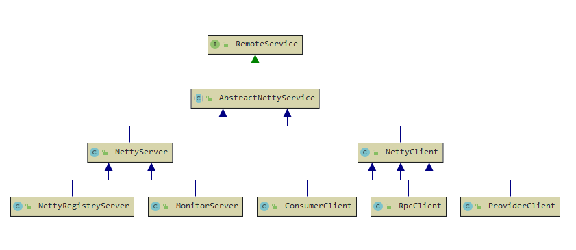
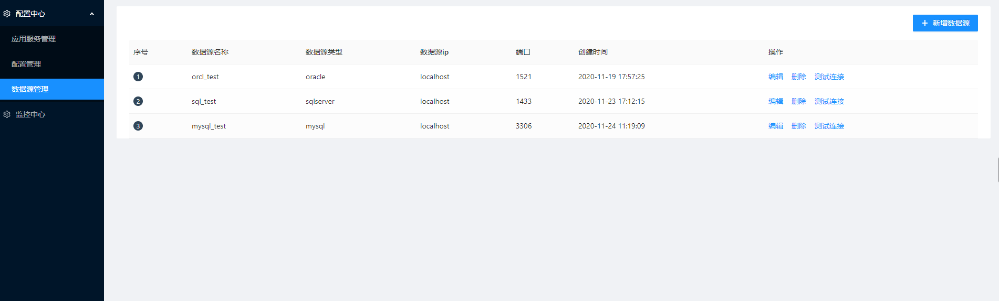
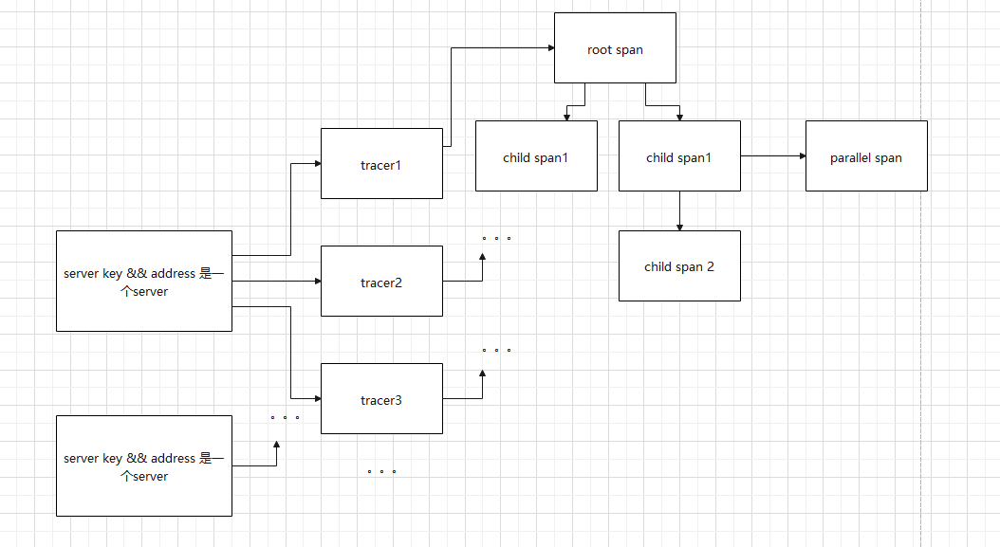

[TOC]

# 简介

**Screw**是一款基于netty实现的rpc框架，它用于微服务治理。内部包含三个角色，注册中心、服务提供者、服务消费者，实现消费者端的负载均衡，可以基于同步、异步进行rpc请求。

- 注册中心：维护服务注册表、消费者订阅表。心跳机制判断提供者、消费者是否存活。
- 提供者：把自身发布的服务，ip:port发送给注册中心，等待消费者连接。与注册中心断线重连
- 消费者：把需要订阅的服务从注册中心获取，随后与提供者直连进行TCP通信。与注册中心断线重连

技术栈：netty、prostubff（序列化框架）。

# 基本使用

在下面内容中将介绍screw框架中rpc、配置中心、监控中心的使用

## 引入jar包

```java
<!-- 作为provider -->
<dependency>
   <groupId>com.jw.screw</groupId>
   <artifactId>screw-provider</artifactId>
</dependency>
```

```java
<!-- 作为consumer -->
<dependency>
   <groupId>com.jw.screw</groupId>
   <artifactId>screw-consumer</artifactId>
</dependency>
```

## Provider与Consumer直连通信

创建service，在实现类或者非接口类加上`@ProviderService(publishService = DemoService.class)`注解

```java
interface DemoService {

    String hello(String msg);
}

@ProviderService(publishService = DemoService.class)
class DemoServiceImpl implements DemoService {

    @Override
    public String hello(String msg) {
        System.out.println(msg);
        return msg;
    }
}
```

创建provider，对provider进行配置，使用`nettyProvider.publishServices(new DemoServiceImpl());`发布service

```java
    @Test
    public void provider1() throws InterruptedException {
        NettyProviderConfig providerConfig = new NettyProviderConfig();
        providerConfig.setProviderKey("demo");
        providerConfig.setWeight(3);
        providerConfig.setPort(8081);
        NettyProvider nettyProvider = new NettyProvider(providerConfig);
        nettyProvider.publishServices(new DemoServiceImpl());
        nettyProvider.start();
        TimeUnit.SECONDS.sleep(100);
        nettyProvider.shutdown();
    }
```

创建consumer，使用`nettyConsumer.directService(metadata, "localhost", 8081)`直连provider。通过`ProxyObjectFactory`创建`Proxy`。`ServiceMetadata`是服务元数据，必须要指定服务的`providerKey`

```java
NettyConsumer nettyConsumer = new NettyConsumer();
ServiceMetadata metadata = new ServiceMetadata("demo");
nettyConsumer.directService(metadata, "localhost", 8081);
DemoService o = ProxyObjectFactory
    .factory()
    .consumer(nettyConsumer)
    .metadata(metadata)
    .isAsync(true)
    .newProxyInstance(DemoService.class);
o.hello("2321");
```

## 基于注册中心进行通信

创建registry

```java
DefaultRegistry defaultRegistry = new DefaultRegistry(8080);
defaultRegistry.start();
```

创建provider，使用`nettyProvider.registry(new RemoteAddress("localhost", 8080));`指定注册中心地址

```java
NettyProviderConfig providerConfig = new NettyProviderConfig();
providerConfig.setProviderKey("demo");
providerConfig.setWeight(4);
providerConfig.setPort(8082);
NettyProvider nettyProvider = new NettyProvider(providerConfig);
nettyProvider.publishServices(new DemoServiceImpl());
nettyProvider.registry(new RemoteAddress("localhost", 8080));
nettyProvider.start();

TimeUnit.SECONDS.sleep(100);
nettyProvider.shutdown();
```

创建consumer，`nettyConsumer.register("localhost", 8080);`同provider。注意到`connectionWatcher = nettyConsumer.watchConnect(metadata);`，这一步是关键，是向注册中心订阅需要的provider，获取之后会进行尝试连接provider，此时将进行阻塞，直到连接成功/失败。

```java
NettyConsumer nettyConsumer = new NettyConsumer();
nettyConsumer.register("localhost", 8080);
try {
    nettyConsumer.start();
} catch (InterruptedException e) {
    e.printStackTrace();
}
ServiceMetadata metadata = new ServiceMetadata("demo");
ConnectWatch connectionWatcher = null;
try {
    connectionWatcher = nettyConsumer.watchConnect(metadata);
} catch (InterruptedException | ConnectionException e) {
    e.printStackTrace();
}
DemoService o = ProxyObjectFactory
    .factory()
    .consumer(nettyConsumer)
    .connectionWatcher(connectionWatcher)
    .metadata(metadata)
    .newProxyInstance(DemoService.class);
String hello = o.hello("2");
```

## 异步调用

在registry，provider代码不变的情况下，consumer代码改为：

```java
NettyConsumer nettyConsumer = new NettyConsumer();
ServiceMetadata metadata = new ServiceMetadata("demo");
nettyConsumer.register("localhost", 8080);
nettyConsumer.start();
ConnectWatch connectionWatcher = nettyConsumer.watchConnect(metadata);
DemoService o = ProxyObjectFactory
    .factory()
    .consumer(nettyConsumer)
    .metadata(metadata)
    .isAsync(true)
    .connectionWatcher(connectionWatcher)
    .newProxyInstance(DemoService.class);
o.hello("21");
final InvokeFuture<String> future;
try {
    future = InvokeFutureContext.get(String.class);
    future.addListener(new FutureListener<String>() {
        @Override
        public void completed(String result, Throwable throwable) throws Exception {
            if (future.isSuccess()) {
                System.out.println(result);
            } else {
                System.out.println(throwable.getMessage());
            }
        }
    });
} catch (InvokeFutureException e) {
    e.printStackTrace();
}
```

通过`InvokeFutureContext.get(String.class);`获取该rpc调用的futrue对象，参数为目标方法返回值类型。随后通过addListener添加监听，但rpc调用成/失败，都会进行回调。

## provider将某个方法的结果发送给订阅者

```java
NettyProviderConfig providerConfig = new NettyProviderConfig();
providerConfig.setProviderKey("demo");
providerConfig.setWeight(4);
providerConfig.setPort(8082);
DemoServiceImpl demoService = new DemoServiceImpl();
final NettyProvider nettyProvider = new NettyProvider(providerConfig);
nettyProvider.publishServices(demoService);
nettyProvider.registry(new RemoteAddress("localhost", 8080));
ExecutorService executorService = Executors.newFixedThreadPool(1);
executorService.submit(new Runnable() {
    @Override
    public void run() {
        try {
            nettyProvider.start();
        } catch (InterruptedException e) {
            e.printStackTrace();
        }
    }
});

TimeUnit.SECONDS.sleep(3);

Notifier notifier = new Notifier(nettyProvider);
String hello = demoService.hello("21");
notifier.unicast(hello, DemoServiceImpl.class, "hello", new Class<?>[] {String.class});

TimeUnit.SECONDS.sleep(3);
String msg = demoService.msg();
notifier.unicast(msg, DemoServiceImpl.class, "msg", new Class<?>[] {});
TimeUnit.SECONDS.sleep(2000);
nettyProvider.shutdown();
```

关键是在`notifier.unicast(hello, DemoServiceImpl.class, "hello", new Class<?>[] {String.class});`

```java
public void unicast(Object result, Class<?> targetClass, String methodName, Class<?>... parameterTypes)
```

- `result`：目标方法调用的结果。
- `targetClass`：目标的类，注意这里是需要带有`@ProviderPublish`的类。
- `methodName`：目标方法名称。
- `parameterTypes`：方法类型。


```java
try {
    RepeatableFuture<String> watch = Listeners.onWatch("demo", DemoService.class, "hello", new Class<?>[]{String.class});
    watch.addListener(new FutureListener<String>() {
        @Override
        public void completed(String result, Throwable throwable) throws Exception {
            System.out.println(Thread.currentThread().getName() + result);
        }
    });
} catch (NoSuchMethodException e) {
    e.printStackTrace();
}
```

在消费者这一边，通过使用`Listeners.onWatch("demo", DemoService.class, "hello", new Class<?>[]{String.class});`监听目标方法的变化

```java
public static <V> RepeatableFuture<V> onWatch(String providerKey, Class<?> targetClass, String targetMethodName,
                                            Class<?>... parameterTypes)
```

- `providerKey`：服务提供者key。
- `targetClass`：目标类，可以是不带有`@ProviderPublish`的，也可以是。
- `targetmethodName`：目标方法名称。
- `parameterTypes`：方法类型。


存在一种就是`DemoService` consumer没有引入依赖。此时使用`onWatch()`的重载方法

```java
RepeatableFuture<Object> objectRepeatableFuture = Listeners.onWatch("demo", "DemoService", "msg", null);
objectRepeatableFuture.addListener(new FutureListener<Object>() {
    @Override
    public void completed(Object result, Throwable throwable) throws Exception {
        System.out.println(Thread.currentThread().getName() + result);
    }
});
public static <V> RepeatableFuture<V> onWatch(String providerKey, String serviceName, String targetMethodName,
                                              Class<?>... parameterTypes)
```

第二参数只需要填service的名称

## 基于spring

引入依赖

```java
<dependency>
    <groupId>com.jw.screw</groupId>
    <artifactId>screw-support-spring</artifactId>
</dependency>

<dependency>
    <groupId>org.springframework</groupId>
    <artifactId>spring-context</artifactId>
    <version>4.3.0.RELEASE</version>
</dependency>
```

## 注册中心配置

screw-registry.properties

```properties
# 注册中心端口
registry.port=8081
```

```java
/**
 * 注册中心配置类
 * @author jiangw
 * @date 2020/12/10 17:37
 * @since 1.0
 */
@Configuration
@PropertySource(name = "registry", value = {
        "classpath:prop/screw-registry.properties"
}, factory = NullablePropertySourceFactory.class)
public class RegistryConfig {

    @Bean
    public ScrewSpringRegistry screwRegistry() {
        return new ScrewSpringRegistry();
    }

    @Bean
    public RefreshListener refreshListener() {
        return new RefreshListener();
    }
}
```

## 提供者配置

screw-provider.properties

```properties
# 服务key（必须）
server.key=provider2
# 服务地址（必须，注意与tomcat等服务端口区分）
provider.server.port=8099
# 服务提供的地址（可选，若服务需要外网发布，那么需要填写外网转发的ip地址）
provider.address=localhost
# 注册中心地址（必须）
registry.address=localhost
# 注册中心端口（必须）
registry.port=8501
# 服务权重（可选）
weight=4
# 处理rpc请求的核心线程数（可选）
connCount=10
# 监控中心（可选）
monitor.key=monitor_center
# 监控指标收集周期（可选）
monitor.collect.period=10
# 需要发布服务包所在位置（可选）
provider.packageScan=com\\jw\\screw\\admin\\sys\\configuration\\center\\*
```

下面配置类是必须的，如果没有特殊的需要请不要更改

```java
@Configuration
@PropertySource(name = "provider", value = {
        "classpath:prop/screw-provider.properties"
}, factory = NullablePropertySourceFactory.class)
public class ProviderConfig {

    @Bean
    @DependsOn(value = {"screwRegistry"})
    public ScrewSpringProvider screwProvider() {
        return new ScrewSpringProvider();
    }
}
```

## 消费者配置

screw-consumer.properties

```properties
# 服务key（必须，消费者的server）
server.key=3c59dc048e8850243be8079a5c74d079
# 服务port（可选，如果当前服务有作为provider需要填上provider port）
server.port=8085
# 注册中心地址（必须）
registry.address=localhost
# 注册中心端口（必须）
registry.port=8501
# 连接等待时长 unit mills（可选）
waitMills=30000
# 负载均衡策略（可选）
loadbalance=RANDOM_WEIGHT
# 配置中心key（可选）
config.key=config_center
# 监控中心（可选）
monitor.key=monitor_center
# 监控指标收集周期 unit s（可选）
monitor.collect.period=10
# 当前服务作为provider时，需要填与服务提供者提供的端口，用于监控中心（服务作为provider必填）
provider.server.port=8080
```

下面配置类是必须的，如果没有特殊的需要请不要更改

```java
@Configuration
@PropertySource(name = "consumer", value = {
        "classpath:prop/screw-consumer.properties"
}, factory = NullablePropertySourceFactory.class)
public class ConsumerConfig {

    @Bean
    public List<ConsumerWrapper.ServiceWrapper> serviceWrapper() {
        // 如果提供者与消费者引用同一个service，那么可以进行配置
//        List<ConsumerWrapper.ServiceWrapper> wrappers = new ArrayList<>();
//        ConsumerWrapper.ServiceWrapper serviceWrapper = new ConsumerWrapper.ServiceWrapper();
//        serviceWrapper.setServices(Collections.singletonList(DemoService.class));
//        serviceWrapper.setServerKey("provider1");
//        wrappers.add(serviceWrapper);
//        return wrappers;
        return null;
    }

    @Bean
    public ConsumerWrapper consumerWrapper(@Qualifier("serviceWrapper") List<ConsumerWrapper.ServiceWrapper> serviceWrappers) {
        ConsumerWrapper consumerWrapper = new ConsumerWrapper();
        consumerWrapper.setServiceWrappers(serviceWrappers);
        return consumerWrapper;
    }

    @Bean
    public ScrewSpringConsumer screwConsumer(@Qualifier("consumerWrapper") ConsumerWrapper consumerWrapper) {
        ScrewSpringConsumer screwConsumer = new ScrewSpringConsumer();
        screwConsumer.setConsumerWrapper(consumerWrapper);
        return screwConsumer;
    }

    @Bean
    public FactoryBeanRegisterProcessor factory(@Qualifier("screwConsumer") ScrewSpringConsumer screwConsumer) {
        FactoryBeanRegisterProcessor processor = new FactoryBeanRegisterProcessor();
        processor.setProxies(screwConsumer.getProxies());
        return processor;
    }

    @Bean
    public RefreshListener refreshListener() {
        return new RefreshListener();
    }
}
```

### 测试

```java
public class SpringRegistryTest {

    @Test
    public void registry() {
        AnnotationConfigApplicationContext applicationContext = new AnnotationConfigApplicationContext(RegistryConfigTest.class);

        ScrewSpringRegistry bean = applicationContext.getBean(ScrewSpringRegistry.class);
        int registryPort = bean.getRegistryPort();
        System.out.println(registryPort);
    }
}
```

```java
public class SpringProviderTest {

    @Test
    public void provider() throws InterruptedException {
        AnnotationConfigApplicationContext applicationContext = new AnnotationConfigApplicationContext(ProviderConfigTest.class);
        ScrewSpringProvider provider = applicationContext.getBean(ScrewSpringProvider.class);

        TimeUnit.SECONDS.sleep(100);
    }
}
```

```java
public class SpringConsumerTest {

    @Test
    public void consumer() throws InterruptedException {
        AnnotationConfigApplicationContext applicationContext = new AnnotationConfigApplicationContext(ConsumerConfigTest.class);
        DemoService bean = applicationContext.getBean(DemoService.class);
        String hello = bean.hello("2121");

        System.out.println(hello);

        hello = bean.hello("323232");
        System.out.println(hello);

        applicationContext.destroy();
    }
}
```

若provider与consumer引入同一个service包，我们则可以直接从spring context中获取这个bean，并直接进行rpc调用。

若没有引入同一个包，那么

```java
@GetMapping("/syncRpc")
public Object syncRpc(String msg) throws ConnectionException, InterruptedException {
    ServiceMetadata serviceMetadata = new ServiceMetadata("provider1");
    NettyConsumer consumer = screwSpringConsumer.getConsumer();
    ConnectWatch connectionWatcher = consumer.watchConnect(serviceMetadata);
    Object o = ProxyObjectFactory
        .factory()
        .consumer(consumer)
        .metadata(serviceMetadata)
        .isAsync(false)
        .connectionWatcher(connectionWatcher)
        .remoteInvoke("DemoService", "hello", new Object[]{msg});
    System.out.println(o);
    return o;
}
```

或者异步调用

```java
@GetMapping("/asyncRpc")
public Object asyncRpc(String msg) throws ConnectionException, InterruptedException, InvokeFutureException {
    ServiceMetadata serviceMetadata = new ServiceMetadata("provider1");
    NettyConsumer consumer = screwSpringConsumer.getConsumer();
    ConnectWatch connectionWatcher = consumer.watchConnect(serviceMetadata);
    ProxyObjectFactory
        .factory()
        .consumer(consumer)
        .metadata(serviceMetadata)
        .isAsync(true)
        .connectionWatcher(connectionWatcher)
        .remoteInvoke("DemoService", "hello", new Object[]{msg});
    InvokeFuture<String> stringInvokeFuture = InvokeFutureContext.get(String.class);
    stringInvokeFuture.addListener(new FutureListener<String>() {
        @Override
        public void completed(String s, Throwable throwable) throws Exception {
            System.out.println(s);
        }
    });
    return null;
}
```

## 配置中心

**在加上配置中心后，一个服务必须是消费者的配置文件中加上配置中心的server key，这样我们可以在服务启动时动态刷新配置。**

### @ScrewValue

`@ScrewValue`注解与Spring`@Value`注解类似，只要被该注解的字段可以实现动态刷新，因为配置是以json形式创建，所有给出以下约定：

1. 如果配置是：{config: {subConfig: value}}形式，解析出来的配置结果是：config.subConfig
2. 如果配置是：{config: [{subConfig: value}]}形式，解析出来的配置结果是：config[0].subConfig
3. 作为array的数据一定是key-value形式

如果一个配置不满足上面约定，那么这个配置无法成功解析。

`@ScrewValue`关于配置的获取的规则为：**配置文件名-具体配置名称**

比如，文件名为address，里面的配置为：

```json
{
    "address":{
        "defaultCfg":{
            "cityName":"武汉",
            "transType":"svr"
        },
        "types":[
            {
                "name":"百度",
                "type":"baidu"
            },
            {
                "name":"本地",
                "type":"local"
            }
        ]
    }
}
```

那么解析address-address.defaultCfg.cityName的值为武汉

```java
@ScrewValue("address-address.defaultCfg.cityName")
private String address;

@ScrewValue("address-address.types[0].name")
private String name;
```

### Property

`Property`是一个获取配置上下文的类，可以直接通过它获取到相应的配置。使用为：

```java
Property.get(String name);
// 如
Property.get("address-address.defaultCfg.cityName");
// 也可以根据基本类型获取
Property.getString(String name);
Property.getInteger(String name);
...
```

### 基于配置类的形式

假设我们存在一个`RedisProperties`的配置类

```java
@ConfigurationProperties(prefix = "redis")
@Component
public class RedisProperties {

    private int port;

    public int getPort() {
        return port;
    }

    public void setPort(int port) {
        this.port = port;
    }
}
```

那么使用**Screw**框架会自动进行配置注入和配置刷新。在配置中心的UI操作界面则为：


  

**值得注意的是配置key第一个前缀必须是配置类的prefix的名称，否则不能被spring解析。**

## 监控中心

监控使得我们可以知道每一个服务（消费者、注册中心、提供者）的性能指标如内存、gc、堆和健康状况，并可以实现阈值报警（暂未实现）。还可以通过链路追踪快速定位某个接口、某个rpc请求（已实现）、某个流程流转的调用链路，通过这个链路能够快速跟踪到问题的所在。

如果有服务存在于注册中心中，那么在UI页面会看到下面的列表，该列表会实时监控服务的健康状况，并允许查看服务的性能指标与链路追踪。一个服务允许同时作为provider、consumer。


### 性能指标


### 链路追踪


### 使用

**在项目启动前，加上VM参数-javaagent:[agent包路径]，如下：**

```java
-javaagent:D:\java\patrol\patrol-toolbox\screw\screw-monitor\screw-monitor-agent\target\screw-monitor-agent-1.0.jar
```

**并在配置文件中加上monitor.key的值（无论consumer或provider）**

## 基于spring boot

spring boot版本需低于2.2.x（配置刷新还未支持高版本）

引入依赖

```java
<dependency>
    <groupId>com.jw.screw</groupId>
    <artifactId>screw-spring-boot-starter</artifactId>
    <version>1.0</version>
</dependency>
```

### 在启动类上添加注解

#### 作为consumer

```java
@SpringBootApplication
@EnableScrewConsumer(serverKey = "3c59dc048e8850243be8079a5c74d079", configKey = "config_center", monitorKey = "monitor_center")
public class SpringBootConsumerApplication {

    public static void main(String[] args) {
        SpringApplication application = new SpringApplication(SpringBootConsumerApplication.class);
        application.run(args);
    }
}
```

其中**serverKey**为ui管理平台的服务code，如下：


#### @EnableScrewConsumer注解说明

```java
public @interface EnableScrewConsumer {

    /**
     * 服务key
     */
    String serverKey();

    /**
     * 服务端口，如果当前服务作为provider那么作为consumer的端口一定与其相同。
     */
    int serverPort() default 8080;

    /**
     * 注册中心host
     */
    String registryAddress() default "localhost";

    /**
     * 注册中心port
     */
    int registryPort() default 8501;

    /**
     * 连接等待时长
     */
    long waitMills() default 30000;

    /**
     * 负载均衡
     */
    String loadBalance() default "";

    /**
     * 配置中心key，如果存在则填写
     */
    String configKey() default "";

    /**
     * 监控中心key，如果存在则填写
     */
    String monitorKey() default "";

    /**
     * 监控指标收集周期 unit Second
     */
    int monitorCollectPeriod() default 10;
}
```

#### 作为provider

- serverKey：serverKey它与consumer的serverKey不一致
- serverPort：serverPort是与当前springboot应用不一致的端口

```java
@SpringBootApplication
@EnableScrewProvider(serverKey = "provider1", serverPort = 9001, monitorKey = "monitor_center")
@EnableScrewConsumer(serverKey = "c81e728d9d4c2f636f067f89cc14862c", configKey = "config_center", monitorKey = "monitor_center", serverPort = 9001)
public class SpringBootProviderApplication {

    public static void main(String[] args) {
        SpringApplication.run(SpringBootProviderApplication.class, args);
    }
}
```

#### @EnableScrewProvider

```java
public @interface EnableScrewProvider {

    /**
     * 服务key
     */
    String serverKey();

    /**
     * 提供者port 需要与tomcat jetty等服务器区分
     */
    int serverPort();

    /**
     * 注册中心host
     */
    String registryAddress() default "localhost";

    /**
     * 注册中心端口
     */
    int registryPort() default 8501;

    /**
     * 服务权重
     */
    int weight() default 4;

    /**
     * 处理rpc请求的核心线程数
     */
    int connCount() default 10;

    /**
     * 监控中心
     */
    String monitorKey() default "";

    /**
     * 监控指标收集周期 unit second
     */
    int monitorCollectPeriod() default 10;

    /**
     * 发布服务包所在位置
     */
    String packageScan() default "";

    /**
     * 当前服务是否是配置中心
     */
    boolean isConfigCenter() default false;
}
```

#### 作为consumer与provider

当一个spring boot作为provider与consumer时，有以下需要注意

- 他们两个的serverKey不一致
- 他们两个的serverPort是一致的，并且都需要填写

```java
@SpringBootApplication
@EnableScrewProvider(serverKey = "provider1", serverPort = 9001, monitorKey = "monitor_center")
@EnableScrewConsumer(serverKey = "c81e728d9d4c2f636f067f89cc14862c", configKey = "config_center", monitorKey = "monitor_center", serverPort = 9001)
public class SpringBootProviderApplication {

    public static void main(String[] args) {
        SpringApplication.run(SpringBootProviderApplication.class, args);
    }
}
```


# <a id="logging">日志使用</a>

## Spring Boot

### 引入jar包

```xml
<dependency>
    <groupId>com.jw</groupId>
    <artifactId>screw-logging-spring-boot-starter</artifactId>
    <version>1.1</version>
</dependency>
```

### 增加配置文件screw-storage.yml

在spring-boot根目录路径下添加`screw-storage.yml`（即与`application.yml`同级目录）文件。

```yaml
# 是否开启
enable: true
# 持久性策略，支持以逗号分别，使用不同的存储引擎存储
readPersistence: db # 0.memory 1.file 2.db 3.redis 4.es 5.hive
writePersistence: db # 0.memory 1.file 2.db 3.redis 4.es 5.hive
memory:
  capacity: 16
  loadFactor: 0.75
  concurrencyLevel: 1
# db
database:
  driverClassName: com.mysql.jdbc.Driver
  initial-size: 5
  max-active: 10
  min-idle: 5
  username: root
  password: 123456
  url: jdbc:mysql://localhost:3306/test?useUnicode=true&characterEncoding=utf-8&serverTimezone=Hongkong
# redis
redis:
  host: 121.5.37.140
  port: 6379
  database: 0
# es
es:
  index: screw_log_index
  hostname: 121.5.37.140
  port: 9200
  scheme: http
file:
  print-path: D://temp//logs
  file-suffix: .txt
  accumulation: 10
  split: ","
# 继承自file
hive:
  print-path: D://temp//logs
  file-suffix: .txt
  accumulation: 10
  user: root
  password:
  url: jdbc:hive2://localhost:9999/log_db
  driverClassName: org.apache.hive.jdbc.HiveDriver
  table-name: logs
```

## 使用ScrewLog注解

使用`@ScrewLog`可以加载类上或者方法上，如下：

```java
@Service
@ScrewLog(type = "测试")
public class TestServiceImpl implements TestService {

    @Override
    public void test() {

    }

    @Override
    @ScrewLog(type = "测试输出")
    public void testPrint() {
        int i = 1 / 0;
    }
}
```

- 如果注解类上：对所有的方法都会生效，也就是说调用某个方法结束后，将会把数据发送到对应数据源上进行存储。
- 如果注解方法上：即使当前类上注解了，但最终生效的还是方法。

## 侵入式收集slf4j日志数据

SLF4J是为各种loging APIs提供一个简单统一的接口，从而使得最终用户能够在部署的时候配置自己希望的loging APIs实现。 Logging API实现既可以选择直接实现SLF4J接的loging APIs如： NLOG4J、SimpleLogger。也可以通过SLF4J提供的API实现来开发相应的适配器如Log4jLoggerAdapter、JDK14LoggerAdapter。

项目基本上使用`logback`或者`log4j2`。所以在screw的日志框架中对这两种框架都支持了对应的appder类，即`ScrewLog4j2`与`ScrewLogBack`。

如果需要支持则需要在对应的日志文件增加appder。

### logback增加appder

```xml
<?xml version="1.0" encoding="UTF-8"?>
<configuration debug="false">
    <!--定义日志文件的存储地址 勿在 LogBack 的配置中使用相对路径-->
    <!--<property name="LOG_HOME" value="/home" />-->
    <!-- 控制台输出 -->
    <appender name="STDOUT" class="ch.qos.logback.core.ConsoleAppender">
        <encoder class="ch.qos.logback.classic.encoder.PatternLayoutEncoder">
            <!--格式化输出：%d表示日期，%thread表示线程名，%-5level：级别从左显示5个字符宽度%msg：日志消息，%n是换行符-->
            <pattern>%d{yyyy-MM-dd HH:mm:ss.SSS} [%thread] %-5level %logger{50} - %msg%n</pattern>
        </encoder>
    </appender>
    <appender name="SCREW" class="com.jw.screw.logging.core.component.ScrewLogBack">
        <filter class="ch.qos.logback.classic.filter.LevelFilter">
            <level>INFO,WARN,ERROR,FATAL</level>
            <onMatch>ACCEPT</onMatch>
            <onMismatch>DENY</onMismatch>
        </filter>
        <appName>本地日志输出</appName>
        <enable>true</enable>
    </appender>
    <!-- 日志输出级别 -->
    <root level="warn">
        <appender-ref ref="STDOUT" />
        <appender-ref ref="SCREW" />
    </root>
</configuration>
```

### log4j2增加appder

```xml
<configuration status="INFO" monitorInterval="30">
    <appenders>
        <!--这个输出控制台的配置-->
        <console name="Console" target="SYSTEM_OUT">
            <!--输出日志的格式-->
            <PatternLayout pattern="%highlight{[ %p ] [%-d{yyyy-MM-dd HH:mm:ss}] [%l] %m%n}"/>
        </console>

        <ScrewAppender name="screwAppender" appName="本地日志输出" enable="false">
            <LevelRangeFilter minLevel="FATAL" maxLevel="INFO" onMatch="ACCEPT" onMismatch="DENY"/>
        </ScrewAppender>
    </appenders>
    <loggers>
        <root level="INFO">
            <appender-ref ref="Console"/>
            <appender-ref ref="screwAppender"/>
        </root>
    </loggers>
</configuration>
```


# 设计

## 架构详细说明


### 调用关系说明

1. consumer启动时，将会把自身信息放入注册中心，注册中心每当provider产生变化时都会把这个变化发送给consumer，consumer则会从中选取自己需要的服务创建connector。
2. provider启动时，会把自己的提供的service连带自身信息发送到注册中心，并与其保持长连接。
3. 注册中心维护了两个结构用于存储provider/consumer，当连接丢失时，将会从这个两个结构中删除对应的服务。
4. 监控中心的职能有点类似注册中心，但它存储的结构是监控信息并且与provider/consumer保持长连接。
5. 配置中心是一个provider，所以它的配置推送的目标是consumer，推送的结构类似于rabbitmq的交换器模型，当某个配置改变时，配置中心会向注册中心发送单播通知，注册中心收到之后，会向所有的消费者发送广播，当某一个消费者与之server key一致将会刷新配置
6. ui管理平台提供可视化操作界面，可以快速更改某一服务的配置，查看某个服务的性能、健康等信息。

### 模块说明

- screw-admin 管理模块
  - screw-admin-api             对外提供的api接口
  - screw-admin-common   提供公共处理方法
  - screw-admin-sys              核心模块，提供业务实现
  - screw-admin-ui                管理模块ui
  - screw-admin-web            web层
- screw-common       公共库
- screw-consumer     消费者
- screw-loadbalance 负载均衡
- screw-monitor 监控
  - screw-monitor-agent agent包
  - screw-monitor-api monitor客户端
  - screw-monitor-core 监控的核心实现
  - screw-monitor-opentracing 基于opentracing实现的链路追踪
  - screw-monitor-remote monitor服务端
- screw-provider 提供者
- screw-registry 注册中心
- screw-remote 传输层
- screw-spring-support spring支持模块
- screw-spring-boot-starter springboot 启动模块
- screw-storage  screw框架抽象数据中心，处理异构数据源，采用recoder进行读、写。
- screw-logging   screw框架日志部分
  - screw-logging-core 							 日志的核心实现
  - screw-logging-spring-boot-stater     日志对spring boot的支持
  - screw-logging-spring-support           日志对spring的支持
- screw-calculate  大数据计算模块 
  - screw-calculate-spark 基于spark进行数据分析
- screw-test 测试模块

在screw中，总共有14个模块，其中有9个是重要模块：

- screw-remote（远程传输模块）：专门用来处理远程传输模块，目前是基于Netty实现，其中包括Netty服务器、客户端，协议，编码解码，过滤器链，心跳检测，remote的处理器。
- screw-registry（注册中心模块）：注册中心是一个Netty服务器，其主要作用是保存provider、consumer的信息，并与其建立长连接。目前还未引入Zookeeper，所以并不保证强一致性的数据写读。
- screw-provider（提供者模块）：提供者有三个职能，一个是需要进行RPC的服务发送到注册中心，一个是等待consumer连接进行RPC调用，最后一个是作为监控中心的客户端，不断发送自己的性能指标与链路信息到监控中心。
- screw-consumer（消费者模块）：消费者的主要作用是选择需要的服务进行RPC调用，此外也发送自身信息到监控中心。
- screw-monitor（监控中心模块）：监控中心主要包括两个大部分：其一是作为provider等待提供者与消费者连接，其二是是作为Netty client连接监控中心。
- screw-admin（screw管理模板）：对screw框架内部支持的功能提供可视化的界面，目前只支持到配置中心、监控中心、链路追踪的查看。
- screw-storage（抽象数据中心）：对异构数据源采取统一的读写接口处理，其中异构数据源采取配置的形式进行配置。
- screw-logging（日志模板）：提供侵入式日志记录，目前支持自定义注解和slf4j框架进行日志记录，提供对spring的全面支持
- screw-calculate（计算模板）：采取spark对数据进行分析，处理的结果采取抽象数据中心进行统一的处理。

另外4个模块是：

- screw-common（公共模块）：提供一些工具类、异步调用、序列化、传输体等等。
- screw-loadbalance（负载均衡模块）：基于客户端的负载均衡算法，目前仅仅实现了静态负载均衡算法。
- screw-spring-support（spring支持模块）：针对spring，提供无缝接入的解决方案。
- screw-spring-boot-starter（spring boot服务的支持模块）：采用注解形式启动对应系统角色（注册中心，提供者，消费者等），提供更简单的配置形式，与spring boot设计理念一致。

## Remote模块详细设计

在理解remote模块设计之前，先来介绍下RPC与Netty。

### RPC

RPC（Remote Procedure Call）远程过程调用，简单的理解是一个节点请求另一个节点提供的服务，它的过程如下：

**client**

1. Student student = Call(ServerAddr, addAge, student)
2. 将这个调用映射为Call ID。
3. 将Call ID，student（params）序列化，以二进制形式打包
4. 把2中得到的数据包发送给ServerAddr，这需要使用网络传输层
5. 等待服务器返回结果
6. 如果服务器调用成功，那么就将结果反序列化，并赋给student，年龄更新

**server**

1. 在本地维护一个Call ID到函数指针的映射call_id_map，可以用Map<String, Method> callIdMap
2. 等待服务端请求
3. 得到一个请求后，将其数据包反序列化，得到Call ID
4. 通过在callIdMap中查找，得到相应的函数指针
5. 将student（params）反序列化后，在本地调用addAge()函数，得到结果.
6. 将student结果序列化后通过网络返回给Client.


#### RPC与HTTP的区别

RPC是一种**设计理念**，为了解决**不同服务之间调用问题**，完整的RPC实现一般包含**传输协议**和**序列化协议**。

HTTP是一种**传输协议**，RPC框架完全可以使用HTTP作为传输协议，可以直接使用TCP，使用不同的协议一般也是为了适应不同的场景。

**传输效率：**

- TCP:自定义上层协议，请求报文体积更小
- HTTP:基于HTTP1.1的协议，请求中会包含许多无用的内容

**性能消耗：**主要在于序列化与反序列化的耗时

- TCP:可以基于各种序列化框架进行，效率比较高
- HTTP:大部分通过json来实现，字节大小和序列化耗时都要更消耗性能。

**跨平台：**

- TCP:通常要求客户端和服务器为统一平台
- HTTP:可以在各种异构系统上运行

**总结：**

​	RPC的TCP方式主要用于公司内部的服务调用，性能消耗低，传输效率高，HTTP主要用于对外的异构环境，浏览器接口调用，APP接口调用，第三方接口调用等。

[万字总结，RPC 项目相关问题及解答]: https://www.nowcoder.com/discuss/588903

### Netty

Netty是为了快速开发可维护的高性能、高可拓展、网络服务器和客户端程序而提供的异步事件驱动基础框架和工具。


如果需要深入的话推荐看 [《Netty 实战》](https://www.bookstack.cn/read/essential-netty-in-action/SUMMARY.md)

### 协议

下面的协议是screw进行远程传输的所使用的协议规范，在编码解码时进行校验，如果不符合将会抛弃该次传输。

```java
 /**
     * ****************************************************************************************
     *                                          Protocol
     *  ┌ ─ ─ ─ ─ ─ ─ ─ ─ ─ ─ ─ ─ ─ ─ ─ ─ ─ ─ ─ ─ ─ ─ ─ ─ ─ ─ ─ ─ ─ ─ ─ ─ ─ ─ ─ ─ ─ ─ ─ ─ ─ ─ ─ ─ ┐ 
     *       4   │   1   │    1   │     8     │      4      │
     *  ├ ─ ─ ─ ─ ─ ─ ─ ─ ─ ─ ─ ─ ─ ─ ─ ─ ─ ─ ─ ─ ─ ─ ─ ─ ─ ─ ─ ─ ─ ─ ─ ─ ─ ─ ─ ─ ─ ─ ─ ─ ─ ─ ─ ─ │ 
     *           │       │        │           │             │
     *  │  MAGIC   Sign    Type     Invoke Id   Body Length                   Body Content        │      │
     *           │       │        │           │             │
     *  └ ─ ─ ─ ─ ─ ─ ─ ─ ─ ─ ─ ─ ─ ─ ─ ─ ─ ─ ─ ─ ─ ─ ─ ─ ─ ─ ─ ─ ─ ─ ─ ─ ─ ─ ─ ─ ─ ─ ─ ─ ─ ─ ─ ─ ┘ 
     *
     * 消息头16个字节定长
     * = 2 // MAGIC = (int) 0x66
     * + 1 // 消息标志位, 用来表示消息类型
     * + 1 // 空
     * + 8 // 消息 id long 类型
     * + 4 // 消息体body长度, int类型
     */
```

#### Sign的种类

```java
    public interface TransportType {
        /**
         * 远程请求
         */
        byte REMOTE_REQUEST = 1;

        /**
         * 远程响应
         */
        byte REMOTE_RESPONSE = 2;

        /**
         * Ack的处理
         */
        byte ACK = 3;
    }
```

#### Type的种类

```java
   public interface Code {

        /**
         * 未知的类型
         */
        byte UNKNOWN = 0;

        /**
         * 发生一些未知的情况时
         */
        byte FAILED = 1;

        /**
         * 心跳
         */
        byte HEART_BEATS = 2;

        /**
         * 远程请求的调用
         */
        byte RPC_REQUEST = 66;

        /**
         * 远程调用的响应
         */
        byte RPC_RESPONSE = 67;

        /**
         * 生产者服务注册
         */
        byte SERVICE_REGISTER = 68;

        /**
         * 消费者服务订阅
         */
        byte SERVICE_SUBSCRIBE = 69;

        /**
         * 注册中心响应订阅
         */
        byte RESPONSE_SUBSCRIBE = 70;

        /**
         * 服务下线通知
         */
        byte SERVICE_OFFLINE = 71;

        /**
         * 单播
         */
        byte UNICAST = 72;

        /**
         * 广播
         */
        byte BROADCAST = 73;

        /**
         * 性能指标
         */
        byte METRICS = 74;

        /**
         * 链路追踪
         */
        byte TRACING = 75;

        /**
         * 监控中心地址
         */
        byte MONITOR_ADDRESS = 76;
    }
```

### 远程传输对象

远程传输对象即符合协议的规范传输的对象，即`RemoteTransporter`类。它包含以下几种字段。每一类的code都与body一一对应。

```java
    /**
     * 传输的类型{@link Protocol.Code}
     */
    private byte code;


    private long unique = IdUtils.getNextId();

    /**
     * 1.请求消息体
     * 2.响应消息体
     * 3.发布消息体
     * 4.订阅消息体...
     */
    private Body body;

    /**
     * 请求or响应{@link Protocol.TransportType}
     */
    private byte transporterType;
```

#### body

在远程传输对象中的body，每一个body对应对应着协议中的type类型，比如RPC_REQUEST的type，那么它的body就是

```java
public class RequestBody extends AbstractBody {

    private final static AtomicInteger ID_GENERATOR = new AtomicInteger(0);

    /**
     * 调用唯一id，以此对应消费者与提供者之间的请求
     */
    private final long invokeId;

    /**
     * 服务名
     */
    private String serviceName;

    /**
     * 调用的方法名
     */
    private String methodName;

    /**
     * 请求的参数
     */
    private Object[] parameters;

    /**
     * 请求期望返回的类型
     */
    private transient Class<?> expectedReturnType;
	
	...
}
```

### 编码器与解码器

任何数据的网络传输都是基于字节进行，所以编码器与解码器的作用就尤其重要，在数据出去前需要把数据编码成二进制的字节码数据，在数据进入时候再把数据进行编码转换成普通的Java POJO类。

Netty提供了成熟的解决方案：

通过继承`MessageToByteEncoder`类，可以完成Java POJO对象的编码，它的本质是一个出站处理器。

```java
public class RemoteTransporterEncoder extends MessageToByteEncoder<RemoteTransporter> {

    @Override
    protected void encode(ChannelHandlerContext ctx, RemoteTransporter msg, ByteBuf out) throws Exception {
        // 对象序列化
        byte[] bytes = SerializerHolders.serializer().serialization(msg);
        msg.setBytes(bytes);
        // 发送请求头
        out.writeInt(Protocol.MAGIC)
                .writeByte(msg.getTransporterType())
                .writeByte(msg.getCode())
                .writeLong(msg.getUnique())
                .writeInt(msg.length())
                .writeBytes(bytes);
    }
}
```

通过继承`ReplayingDecoder`类，实现字节码的解码，它本质上是一个入站处理器。

```java
public class RemoteTransporterDecoder extends ReplayingDecoder<Protocol.State> {

    private static Logger recoder = LoggerFactory.getLogger(RemoteTransporterDecoder.class);


    private final static int MAX_BODY_LENGTH = 20 * 1024 * 1024;

    private final Protocol header;

    public RemoteTransporterDecoder() {
        // 初始化时，记录bytebuf状态为模式
        super(Protocol.State.HEADER_MAGIC);
        header = new Protocol();
    }

    @Override
    protected void decode(ChannelHandlerContext ctx, ByteBuf in, List<Object> out) throws Exception {

        switch (state()) {
            case HEADER_MAGIC:
                validateMagic(in.readInt());
                checkpoint(Protocol.State.HEADER_SIGN);
            case HEADER_SIGN:
                header.setSign(in.readByte());
                checkpoint(Protocol.State.HEADER_TYPE);
            case HEADER_TYPE:
                header.setType(in.readByte());
                checkpoint(Protocol.State.HEADER_INVOKER_ID);
            case HEADER_INVOKER_ID:
                header.setInvokeId(in.readLong());
                checkpoint(Protocol.State.HEADER_BODY_LENGTH);
            case HEADER_BODY_LENGTH:
                header.setBodyLength(in.readInt());
                checkpoint(Protocol.State.BODY);
            case BODY:
                byte[] bytes = new byte[checkBodyLength(header.getBodyLength())];
                in.readBytes(bytes);
                RemoteTransporter remoteTransporter = SerializerHolders.serializer().deserialization(bytes, RemoteTransporter.class);
                if (recoder.isDebugEnabled()) {
                    recoder.debug("decode remote transporter: {}", remoteTransporter);
                }
                if (remoteTransporter.getCode() != Protocol.Code.HEART_BEATS) {
                    out.add(remoteTransporter);
                }
                // 设置都指针断点，使下一次读取数据时能从MAGIC处开始读取。
                checkpoint(Protocol.State.HEADER_MAGIC);
                break;
            default:
                break;
        }
    }

    @Override
    public void exceptionCaught(ChannelHandlerContext ctx, Throwable cause) throws Exception {
        cause.printStackTrace();
        super.exceptionCaught(ctx, cause);
    }

    private void validateMagic(int magic) throws RemoteException {
        if (magic != Protocol.MAGIC) {
            throw new RemoteException("magic validate error...");
        }
    }

    private int checkBodyLength(int bodyLength) throws RemoteException {
        if (bodyLength >= MAX_BODY_LENGTH) {
            throw new RemoteException("body bytes to more");
        }
        return bodyLength;
    }

}
```

### 解决半包问题

半包问题的实质是TCP缓存数据比较大时，会把数据包拆分成多个进行传输，当TCP缓存数据数据比较小时，一次复制的却不止一个内核缓存包，所以就会半包问题。

使用Netty的`LengthFieldBasedFrameDecoder`定长字段长度编码器与`LengthFieldPrepender`定长长度字段解码器。

### 心跳检测

如果底层TCP连接已经断开，但是服务器并没有正常的关闭套接字，服务器任然认为这条TCP连接任然存在。解决这种假死的办法是：客户端定时进行心跳检测、服务器端定时进行空闲检测。

解决方案：

1. 客户端连接服务端
2. 在客户端的的`ChannelPipeline`中加入一个比较特殊的`IdleStateHandler`，设置一下客户端的写空闲时间，例如5s
3. 当客户端的所有`ChannelHandler`中4s内没有write事件，则会触发`userEventTriggered`方法
4. 我们在客户端的`userEventTriggered`中对应的触发事件下发送一个心跳包给服务端，检测服务端是否还存活，防止服务端已经宕机，客户端还不知道
5. 同样，服务端要对心跳包做出响应，其实给客户端最好的回复就是“不回复”，这样可以服务端的压力，假如有10w个空闲Idle的连接，那么服务端光发送心跳回复，则也是费事的事情，那么怎么才能告诉客户端它还活着呢，其实很简单，因为5s服务端都会收到来自客户端的心跳信息，那么如果10秒内收不到，服务端可以认为客户端挂了，可以close链路
6. 加入服务端因为什么因素导致宕机的话，就会关闭所有的链路链接，所以作为客户端要做的事情就是断线重连

```java
@ChannelHandler.Sharable
public class ClientIdleTrigger extends ChannelInboundHandlerAdapter {

    private static Logger recoder = LoggerFactory.getLogger(ClientIdleTrigger.class);

    @Override
    public void userEventTriggered(ChannelHandlerContext ctx, Object evt) throws Exception {
        if (evt instanceof IdleStateEvent) {
            IdleStateEvent idleStateEvent = (IdleStateEvent) evt;
            if (idleStateEvent.state() == IdleState.WRITER_IDLE) {
                if (recoder.isDebugEnabled()) {
                    recoder.debug("client write idle... started send heart beats data package");
                }
                ctx.channel().writeAndFlush(HeartBeats.heartbeat());
            }
        } else {
            super.userEventTriggered(ctx, evt);
        }
    }
}
```

```java
@ChannelHandler.Sharable
public class ServerIdleTrigger extends ChannelInboundHandlerAdapter {

    private static Logger recoder = LoggerFactory.getLogger(ServerIdleTrigger.class);

    private final ThreadLocal<AtomicInteger> threadLocalCounter = new ThreadLocal<>();

    @Override
    public void userEventTriggered(ChannelHandlerContext ctx, Object evt) throws Exception {
        if (evt instanceof IdleStateEvent) {
            IdleStateEvent idleStateEvent = (IdleStateEvent) evt;
            AtomicInteger readTimeoutCount = threadLocalCounter.get();
            threadLocalCounter.remove();
            if (readTimeoutCount == null) {
                readTimeoutCount = new AtomicInteger(0);
            }
            if (idleStateEvent.state() == IdleState.READER_IDLE) {
                if (readTimeoutCount.getAndIncrement() >= HeartBeats.config().getAccept()) {
                    readTimeoutCount.set(0);
                    if (recoder.isWarnEnabled()) {
                        recoder.warn("free channel: {}, ", ctx.channel());
                    }
                    ctx.fireChannelInactive();
                }
                threadLocalCounter.set(readTimeoutCount);
            }
        } else {
            super.userEventTriggered(ctx, evt);
        }
    }
}
```

### 重连检测

在netty client中增加一个入站处理器，连接不稳定时，因为是基于长连接，所以当netty server假死时，将会进行断线重连，其关键是使用`channelInactive`事件，进行`RE_CONNECTION_MAX_NUM`次数的重连。

```java
public void channelInactive(ChannelHandlerContext ctx) throws Exception {
    if (!isReConnect()) {
        if (recoder.isWarnEnabled()) {
            recoder.warn("cancel re connect");
        }
        return;
    }

    if (recoder.isDebugEnabled()) {
        recoder.debug("client started re connection");
    }
    if (firstConnect) {
        InetSocketAddress socketAddress = (InetSocketAddress) ctx.channel().remoteAddress();
        this.socketAddress = new RemoteAddress(socketAddress.getHostString(), socketAddress.getPort());
        firstConnect = false;
    }
    AtomicInteger attempt = attempts.get();
    attempts.remove();
    if (attempt == null) {
        attempt = new AtomicInteger(0);
    }
    if (attempt.getAndIncrement() < RE_CONNECTION_MAX_NUM) {
        long timed = 2L << attempt.get();
        timer.newTimeout(this, timed, TimeUnit.MILLISECONDS);
    } else {
        if (recoder.isInfoEnabled()) {
            recoder.info("client re connection failed, because attempts more than re connection max num");
        }
    }
    attempts.set(attempt);
    ctx.fireChannelInactive();
}
```

进行重连时使用了一个定时任务，即`TimeTask`，通过重写run()方法，在里面具体实现重连操作。

```java
public void run(Timeout timeout) throws Exception {
    ChannelFuture channelFuture;
    synchronized (bootstrap) {
        bootstrap.handler(new ChannelInitializer<SocketChannel>() {
            @Override
            protected void initChannel(SocketChannel ch) throws Exception {
                ch.pipeline().addLast(channelHandlers());
            }
        });
        // 重连
        channelFuture = bootstrap.connect(InetSocketAddress.createUnresolved(socketAddress.getHost(), socketAddress.getPort()));
    }
    channelFuture.addListener(new ChannelFutureListener() {
        @Override
        public void operationComplete(ChannelFuture future) throws Exception {
            if (future.isSuccess()) {
                if (recoder.isInfoEnabled()) {
                    recoder.info("client re connection successful");
                }
            } else {
                if (recoder.isInfoEnabled()) {
                    recoder.info("client re connection failed, started next times re connection");
                }
                future.channel().pipeline().fireChannelInactive();
            }
        }
    });
}
```

### 序列化

序列化把数据结构或对象状态转换成可取用的格式（如存于文件、存于缓存、或网络中发送），以留待后续在相同或另一台计算机环境中，能恢复原来状态的过程。

序列化把对象、文件转换成二进制数组，可以用流进行数据传输，文件流、对象流、网络流。

在screw中序列化有两种方案，一种是`JSON`、另外则是Google`Protostuff`。因为是基于spi进行实现所以可以在


更改实现类。

### 过滤器链

在screw中的过滤器链基于责任链模式，它的设计与Netty的入站/出站处理器类似，分为入站过滤器与出站过滤器。当请求发送时将会触发出站过滤器，响应到来时触发入站过滤器链。在`AbstractNettyService`中的`doRequestAndResponse()`方法。

```java
    protected void doRequestAndResponse(ChannelHandlerContext ctx, RemoteTransporter remoteTransporter) {
        switch (remoteTransporter.getTransporterType()) {
            case Protocol.TransportType.REMOTE_REQUEST:
                // 出站过滤器
                if (Collections.isNotEmpty(outboundFilters)) {
                    FilterChain outboundChain = FilterChainLoader.loadChain(outboundFilters.toArray(new Filter[]{}));
                    if (outboundChain != null) {
                        try {
                            outboundChain.process(remoteTransporter.getBody(), new FilterContext(this, ctx, remoteTransporter));
                        } catch (InterruptedException | RemoteTimeoutException | RemoteSendException e) {
                            recoder.warn("filter chain process error: {}", e.getMessage());
                            e.printStackTrace();
                        }
                    }
                }
                break;
            case Protocol.TransportType.REMOTE_RESPONSE:
                // 入站过滤器
                if (Collections.isNotEmpty(inboundFilters)) {
                    FilterChain chain = FilterChainLoader.loadChain(inboundFilters.toArray(new Filter[]{}));
                    try {
                        if (chain != null) {
                            chain.process(remoteTransporter.getBody(), new FilterContext(this, ctx, remoteTransporter));
                        }
                    } catch (InterruptedException | RemoteTimeoutException | RemoteSendException e) {
                        recoder.warn("filter chain process error: {}", e.getMessage());
                        e.printStackTrace();
                    }
                }
                break;
            case Protocol.TransportType.ACK:
                // 处理Ack的传输
                processAck(remoteTransporter);
            default:
                break;
        }
    }
```

过滤器链中handler角色是`FilterChain`，由`Filter`包装。一个链的处理如下：

```
chain.process() -> filter.filter(chain) -> goon? -> next chain.process() -> or terminate
```

#### FilterChain

```java
public interface FilterChain {

    /**
     * 设置{@link Filter}
     * @param filter
     */
    void setFilter(Filter filter);

    /**
     * @return {@link Filter}
     */
    Filter getFilter();

    /**
     * 下一个过滤链
     */
    FilterChain next();

    /**
     * 设置下一个过滤器
     * @param filterChain
     */
    void setNext(FilterChain filterChain);

    /**
     * 在链中对请求进行过滤
     */
    <T extends FilterContext> void process(Body body, T context) throws InterruptedException, RemoteTimeoutException, RemoteSendException;
}
```

#### Filter

Filter具有权重，权重越低的将会优先执行。在Screw中内置了4个过滤器，分别是`ProcessRequestFilter`（处理请求的过滤器，它是一个出站过滤器）、`ProcessResponseFilter`（处理响应的过滤器，它是一个出站过滤器）。还有两个用于收集监控数据的过滤器`InboundMonitorFilter`、`OutboundMonitorFilter`

```java
public interface Filter extends Comparable<Filter> {

    /**
     * 调用过滤器
     * @param body 请求body
     * @param context 过滤器上下文对象，过滤器可以从里面取一些有用的对象
     * @param next 下一个过滤链
     * @throws InterruptedException
     * @throws RemoteTimeoutException
     * @throws RemoteSendException
     */
    <T extends FilterContext> void doFilter(Body body, T context, FilterChain next) throws InterruptedException, RemoteTimeoutException, RemoteSendException;

    /**
     * 设置当前过滤器的权重，权重越低越优先执行
     * @return
     */
    Integer weight();

    /**
     * 过滤器名称
     */
    String name();
}
```

#### FilterChainLoader

`FilterChainLoader`是一个静态加载优先级过滤器链的类，里面提供了基于过滤器集合或者过滤器链进行过滤器优先级排序。

```java
public class FilterChainLoader {

    /**
     * 根据{@link FilterChain}的过滤器进行权重排序
     * @param chain 过滤器链{@link FilterChain}
     * @return {@link FilterChain}
     */
    public synchronized static FilterChain loadPriority(FilterChain chain) {
        if (chain == null){
            return null;
        }
        final FilterChain headChain = chain;
        // 轮询chain中所有的filter，并加入优先级队列中，随后进行重排序
        PriorityQueue<Filter> priorityFilter = new PriorityQueue<>();
        retry:
        for (;;) {
            Filter filter = chain.getFilter();
            priorityFilter.add(filter);
            if (chain.next() == null) {
                break retry;
            } else {
                chain = chain.next();
            }
        }
        // 重排序chain中的filter
        chain = headChain;
        retry:
        for (;;) {
            chain.setFilter(priorityFilter.poll());
            if (chain.next() == null) {
                break retry;
            } else {
                chain = chain.next();
            }
        }
        return headChain;
    }

    /**
     * 根据filter的权重加载filter chain
     * @param filters 过滤器{@link Filter}
     * @return {@link FilterChain}
     */
    public synchronized static FilterChain loadChain(Filter... filters) {
        if (filters.length == 0) {
            return null;
        }
        PriorityQueue<Filter> priorityFilter = new PriorityQueue<>(Arrays.asList(filters));
        Filter filter = priorityFilter.poll();
        final FilterChain headChain = new DefaultFilterChain(filter, null);
        FilterChain chain = headChain;
        while (!priorityFilter.isEmpty()) {
            DefaultFilterChain filterChain = new DefaultFilterChain(priorityFilter.poll(), null);
            chain.setNext(filterChain);
            chain = filterChain;
        }
        return headChain;
    }
}
```

### 处理器

在screw中针对某一类传输类型如之前说的`RPC_REQUEST`，将会有一个这样的处理器。在`AbstractNettyService`中，使用Map结果存储这样的处理器。它的key是传输类型，value是一个存放着处理器与线程池的元组。

```java
    /**
     * 类型{@link Protocol.Code}的线程处理器
     */
    protected ConcurrentHashMap<Byte, Tuple<NettyProcessor, ExecutorService>> processTables = new ConcurrentHashMap<>();
```

在screw中处理器是针对处理请求的。所以在`AbstractNettyService`的`processRemoteRequest()`方法中，将会由传输类型获取这样的一个处理器，如果没有获取到，将会发送错误的响应。随后调用处理器的process()方法。

```java
    public void processRemoteRequest(final ChannelHandlerContext ctx, final RemoteTransporter remoteTransporter) {
        byte code = remoteTransporter.getCode();
        Tuple<NettyProcessor, ExecutorService> tuple = processTables.get(code);
        // 如果当前的code还没有，使用默认处理器
        if (tuple == null) {
            tuple = NettyProcessors.failProcess(new NullPointerException("unknown code: " + code));
        }
        final NettyProcessor processor = tuple.getKey();
        ExecutorService executor = tuple.getValue();
        executor.submit(new Runnable() {
            @Override
            public void run() {
                // 开启处理业务逻辑
                RemoteTransporter response = processor.process(ctx, remoteTransporter);
                if (response != null) {
                    // 回写响应
                    ctx.channel().writeAndFlush(response).addListener(new ChannelFutureListener() {
                        @Override
                        public void operationComplete(ChannelFuture future) throws Exception {
                            if (future.isSuccess()) {
                                if (recoder.isDebugEnabled()) {
                                    recoder.debug("send response successful. business handle successful");
                                }
                            } else {
                                if (recoder.isWarnEnabled()) {
                                    recoder.warn("send response error, {}", future.cause().getMessage());
                                    future.cause().printStackTrace();
                                }
                            }
                        }
                    });
                } else {
                    if (recoder.isDebugEnabled()) {
                        recoder.debug("business handler return result is empty...");
                    }
                }
            }
        });
    }
```

在回过头看看`NettyProcessor`接口的定义，它的process()方法将会接受`ChannelHandlerContext`与`RemoteTransporter`的请求作为参数，在内部处理器完请求后同样也是返回一个`RemoteTransporter`作为响应。

```java
/**
 * 针对某一类类型创建其处理器，远程调用请求，解析请求，调用服务，注册请求，订阅定期...
 * <p>
 *     一个Processor对应一个业务线程池，由{@link AbstractNettyService#processRemoteRequest(ChannelHandlerContext, RemoteTransporter)}
 *     进行调用{{@link #process(ChannelHandlerContext, RemoteTransporter)}}
 * </p>
 * <p>
 *     使用{@link AbstractNettyService#registerProcessors(byte, NettyProcessor, ExecutorService)}对某一类{@link NettyProcessor}进行注册
 * </p>
 * @see Protocol.Code
 * @author jiangw
 * @date 2020/11/26 17:08
 * @since 1.0
 */
public interface NettyProcessor {

    /**
     * 根据某一类{@link Protocol.Code}处理对应的业务请求
     * @param ctx {@link ChannelHandlerContext}
     * @param request {@link RemoteTransporter}
     * @return 处理的结果
     */
    RemoteTransporter process(ChannelHandlerContext ctx, RemoteTransporter request);
}
```

### 连接器

在screw中内部维护了一个`ChannelGroup`，用于存放client-server之间的通道。

```java
public interface ChannelGroup {

    /**
     * 轮询获取通道组中的某一个通道
     * @return
     */
    Channel next();

    /**
     * 添加通道
     * @param channel
     * @return
     */
    boolean add(Channel channel);

    /**
     * 移除通道
     * @param channel
     */
    void remove(Channel channel);

    /**
     * 移除全部通道
     */
    void removeAll() throws InterruptedException;

    /**
     * 当前通道组是否是可用的
     * @return
     */
    boolean isAvailable();

    /**
     * 通道的数量
     * @return
     */
    int size();
}
```

screw的连接器同样是一个具有权重的，用于负载均衡，其内部维护了一个`ChannelGroup`，用来存放连接的通道。

```java
public interface SConnector extends Comparable<SConnector>{

    /**
     * 获取连接地址
     * @return
     */
    UnresolvedAddress address();

    /**
     * 设置是否重连
     * @param reConnect
     */
    void setReConnect(boolean reConnect);

    /**
     * 设置channelFuture
     * @param channelFuture
     */
    void setChannelFuture(ChannelFuture channelFuture);

    /**
     * 创建一个channel
     * @return {@link Channel}
     * @throws ConnectionException
     */
    Channel createChannel() throws ConnectionException;

    /**
     * 返回当前连接器的通道组
     * @return {@link ChannelGroup}
     */
    ChannelGroup channelGroup();

    /**
     * <p>
     *     1.关闭{@link ChannelGroup}中所有的{@link Channel}
     * </p>
     * <p>
     *     2.移除remoteChannels的通道缓存数据
     * </p>
     * @throws InterruptedException 中断异常
     */
    void close() throws InterruptedException;

    /**
     * 权重，用于负载均衡
     * @return
     */
    int weight();
}
```

### RemoteService

RemoteService是一个Screw中远程传输的顶层接口，它基于Netty设计，包含了初始化、启动、关闭、RPC请求等声明。下面是它的类结构图，它有两条分支，一条是作为Netty服务器、一条是作为Netty客户端。



```java
public interface RemoteService {

    /**
     * 初始化远程 server/client
     */
    void init();

    /**
     * 启动服务.客户端或服务器端
     */
    void start();

    /**
     * 并不使用强制关闭
     * @throws InterruptedException
     */
    void shutdownGracefully() throws InterruptedException;

    /**
     * 对请求时异步调用，对返回的结果时同步阻塞。
     * @param channel 调用的通道
     * @param request 请求
     * @param timeout 超时时间
     */
    RemoteTransporter syncInvoke(Channel channel, RemoteTransporter request, long timeout) throws InterruptedException, RemoteTimeoutException, RemoteSendException;

    /**
     * 实现未阻塞的异步调用
     * @param channel {@link Channel}
     * @param request {@link RemoteTransporter} {@link RequestBody}
     * @param returnType {@link Class} 期望返回值的类型
     * @return 一个promise对象，详细见{@link AbstractNettyService.AsyncPromise}
     */
    Object asyncInvoke(Channel channel, RemoteTransporter request, Class<?> returnType);

    /**
     * 关闭业务处理器器线程池
     */
    void shutdownProcessors();

    /**
     * 对于服务提供者，需要注册远程调用的处理器
     * 对于消费者，需要注册订阅结果的处理器。。。
     * @param code 消息的类型{@link Protocol.Code}
     * @param processor 对于的处理器
     * @param exec 处理业务逻辑的线程池
     */
    void registerProcessors(byte code, NettyProcessor processor, ExecutorService exec);

    /**
     * 处理请求，由于这一部分需要耗费的时间比较久，所以针对每一类请求开启对应的线程池
     * 1.注册请求
     * 2.订阅请求
     * 3.远程调用请求。。
     * @param ctx {@link ChannelHandlerContext}
     * @param transporter {@link RemoteTransporter}
     */
    void processRemoteRequest(ChannelHandlerContext ctx, RemoteTransporter transporter);

    /**
     * 处理rpc的响应
     * @param ctx {@link ChannelHandlerContext}
     * @param transporter {@link RemoteTransporter}
     */
    void processRemoteResponse(ChannelHandlerContext ctx, RemoteTransporter transporter);

    /**
     * 添加入站过滤器
     * @param filters {@link Filter}
     */
    void addInboundFilter(Filter... filters);

    /**
     * 添加出站过滤器
     * @param filters {@link Filter}
     */
    void addOutboundFilter(Filter... filters);
}
```

### Ack消息确认

在消费者、提供者、注册中心都会维护一个未确认消息的数据结构，定时发送这个未确认的消息。

定义一个发布消息的是A，接收消息的是B。如果A发送Message到B，Message收到消息，就进行处理，如果处理的途中宕机或者其他网络波动。这时候A不知道B的实际情况，以为B已经处理完了，数据就会丢失。所以这就需要Ack对消息进行确认。

1. 在A中定义一个数据结构NonMessage，存放未处理的消息，在发送Message时，额外在这个数据结构中存放这条Message的相应信息。
2. B中处理完之后，发送Ack。A收到之后，从NonMessage移除这条记录
3. 如果迟迟未收到Ack，那么就把NonMessage的消息进行重发。

## Registry模块详细设计

### Registry的模型

在`RegistryContext`中维护了整个Regsitry使用的数据结构，其模型如下图


#### registerChannels

```java
    /**
     * 服务提供者通道列表
     * key: 服务提供者的地址
     * value: 通道
     */
    private final ConcurrentHashMap<UnresolvedAddress, Channel> registerChannels = new ConcurrentHashMap<>();
```

#### subscribeChannels

```java
    /**
     * 消费者订阅的服务
     * key：某个服务提供者的名字
     * value：订阅这个服务消费者的通道
     */
    private final ConcurrentHashMap<String, CopyOnWriteArraySet<Channel>> subscribeChannels = new ConcurrentHashMap<>();
```

#### globeRegisterInfo

```java
    /**
     * 服务提供者注册实例列表，存放多个服务实例
     * key: providerKey
     * value：注册的多个服务元数据
     */
    private final ConcurrentHashMap<String, ConcurrentHashMap<UnresolvedAddress, RegisterMetadata>> globalRegisterInfo =
            new ConcurrentHashMap<>();
```

#### globeServiceInfo

```java
    /**
     * 快速获取服务提供者提供的服务列表
     * key: providerKey
     * value: 注册的多个服务地址
     */
    private final ConcurrentHashMap<ServiceMetadata, CopyOnWriteArraySet<UnresolvedAddress>> globalServiceInfo =
            new ConcurrentHashMap<>();
```

#### nonAck

```java
    /**
     * 未发送成功的消息
     */
    private final ConcurrentHashMap<Long, MessageNonAck> nonAck = new ConcurrentHashMap<>();
```

### 注册中心怎么处理提供者发布的服务

在`NettyRegistryServer`中重写`processRemoteRequest()`方法，当传输类型为`SERVICE_REGISTER`调用`NettyRegistryPublishProcessor`的`process()`方法

```java
    public void processRemoteRequest(ChannelHandlerContext ctx, RemoteTransporter request) {
        byte code = request.getCode();
        if (code == Protocol.Code.MONITOR_ADDRESS) {
            code = Protocol.Code.SERVICE_SUBSCRIBE;
        }
        Tuple<NettyProcessor, ExecutorService> processorTuple = processTables.get(code);
        if (processorTuple == null) {
            // 发送重试的Ack消息
            sendRetryAck(ctx, request);
            return;
        }
        final NettyProcessor processor = processorTuple.getKey();
        ExecutorService executorService = processorTuple.getValue();
        switch (code) {
            case Protocol.Code.SERVICE_REGISTER:
                executorService.submit(new Runnable() {
                    @Override
                    public void run() {
                        // 返回Ack的信息
                        RemoteTransporter ackTransport = processor.process(ctx, request);
                        ctx.channel().writeAndFlush(ackTransport).addListener(ChannelFutureListener.FIRE_EXCEPTION_ON_FAILURE);
                    }
                });
                break;
 ...
    }
```

```java
public class NettyRegistryPublishProcessor implements NettyProcessor {

    private final NettyRegistryServer registerServer;

    public NettyRegistryPublishProcessor(NettyRegistryServer registerServer) {
        this.registerServer = registerServer;
    }

    @Override
    public RemoteTransporter process(ChannelHandlerContext ctx, RemoteTransporter request) {
        AcknowledgeBody acknowledgeBody = new AcknowledgeBody(request.getUnique(), true);
        PublishBody publishBody = (PublishBody) request.getBody();
        RegisterMetadata registerMetadata = new RegisterMetadata(publishBody.getServiceName(),
                publishBody.getWight(),
                publishBody.getConnCount(),
                publishBody.getPublishAddress());
        List<String> publishServices = publishBody.getPublishServices();
        if (Collections.isNotEmpty(publishServices)) {
            Set<String> registryServices = new HashSet<>(publishServices);
            registerMetadata.setPublishService(registryServices);
        }
        registerServer.handleRegister(ctx.channel(), publishBody.getPublishAddress(), registerMetadata, acknowledgeBody);
        return RemoteTransporter
                .createRemoteTransporter(Protocol.Code.UNKNOWN, acknowledgeBody, request.getUnique(), Protocol.TransportType.ACK);
    }

```

真正处理服务注册是`NettyRegistryServer.handleRegister()`方法.这个方法会做如下几件事：

- 把注册服务元数据放入`globalRegisterInfo`中
- 把服务元数据放入channel的attr，用于处理下线
- 向所有消费者发送消息

```java
    public void handleRegister(Channel channel, UnresolvedAddress unresolvedAddress, RegisterMetadata registerMetadata, AcknowledgeBody acknowledgeBody) {
        try {
            ServiceMetadata serviceMetadata = new ServiceMetadata(registerMetadata.getServiceProviderName());
            synchronized (registryContext.getGlobalRegisterInfo()) {
                // 保证当前注册数据存在于这个通道内
                boolean notify = registerService(channel, unresolvedAddress, registerMetadata);
                if (notify) {
                    // 向所有消费者发布消息
                    ConcurrentHashMap<String, CopyOnWriteArraySet<Channel>> subscribeChannels = registryContext.getSubscribeChannels();
                    if (Collections.isEmpty(subscribeChannels)) {
                        return;
                    }
                    CopyOnWriteArraySet<Channel> channels = subscribeChannels.get(registerMetadata.getServiceProviderName());
                    if (Collections.isEmpty(channels)) {
                        return;
                    }
                    ConcurrentHashMap<UnresolvedAddress, RegisterMetadata> registerInfo = registryContext.getRegisterInfo(registerMetadata.getServiceProviderName());
                    for (Channel subscribeChannel : channels) {
                        RegisterBody registerBody = new RegisterBody(serviceMetadata.getServiceProviderName(), Collections.newArrayList(registerInfo.values()));
                        RemoteTransporter remoteTransporter = RemoteTransporter.createRemoteTransporter(Protocol.Code.RESPONSE_SUBSCRIBE, registerBody);
                        subscribeChannel.writeAndFlush(remoteTransporter);
                    }
                }
            }
        } catch (Exception e) {
            recoder.warn("register error: {}", e.getMessage());
            acknowledgeBody.setSuccess(false);
        }
    }
```

```java
public boolean registerService(Channel channel, UnresolvedAddress unresolvedAddress, RegisterMetadata registerMetadata) {
    if (recoder.isInfoEnabled()) {
        recoder.info("register unresolvedAddress: {}, serviceProviderName: {}, publishService: {}", unresolvedAddress, registerMetadata.getServiceProviderName(), registerMetadata.getPublishService());
    }
    ServiceMetadata serviceMetadata = new ServiceMetadata(registerMetadata.getServiceProviderName());
    ConcurrentHashMap<UnresolvedAddress, RegisterMetadata> registerInfo = registryContext.getRegisterInfo(registerMetadata.getServiceProviderName());
    if (registerInfo.putIfAbsent(unresolvedAddress, registerMetadata) == null) {
        registerMetadata.setChannel(channel);
        // 保存服务提供者列表
        CopyOnWriteArraySet<UnresolvedAddress> unresolvedAddresses = registryContext.getServiceInfo(serviceMetadata);
        unresolvedAddresses.add(unresolvedAddress);
        Attribute<CopyOnWriteArraySet<RegisterMetadata>> publishAttr = channel.attr(PUBLISH_KEY);
        CopyOnWriteArraySet<RegisterMetadata> registerSet = publishAttr.get();
        if (Collections.isEmpty(registerSet)) {
            registerSet = new CopyOnWriteArraySet<>();
            publishAttr.set(registerSet);
        }
        registerSet.add(registerMetadata);
        return true;
    }
    // 如果注册实例已经存在于注册中心，那么此时可能是服务提供者再次与注册中心连接，需要重新更新channel
    RegisterMetadata instanceRegister = registerInfo.get(unresolvedAddress);
    if (instanceRegister != null) {
        instanceRegister.setChannel(channel);
        Set<String> publishService = instanceRegister.getPublishService();
        if (Collections.isEmpty(publishService)) {
            publishService = new HashSet<>();
        }
        instanceRegister.setPublishService(publishService);
        if (Collections.isNotEmpty(registerMetadata.getPublishService())) {
            publishService.addAll(registerMetadata.getPublishService());
        }
    }
    // 判断是否有同一个服务加入
    return instanceRegister != null && Collections.union(instanceRegister.getPublishService(), registerMetadata.getPublishService());
}
```

#### RegisterMetadata

一个服务的注册，是通过`RegisterMetadata`获取注册的元数据，其内部包括provider的名称、权重、连接数、发布的服务、provider地址。

```java
public class RegisterMetadata {

    /**
     * 服务提供者的名称
     */
    private final String serviceProviderName;

    /**
     * 服务的权重，负载均衡使用
     */
    private int weight;

    /**
     * 建议连接数，与客户端连接数
     */
    private int connCount;

    /**
     * 发布的服务
     */
    private Set<String> publishService;

    /**
     * 地址
     */
    private final UnresolvedAddress unresolvedAddress;

    /**
     * 所属的通道
     */
    private transient Channel channel;
	
	...
}
```

### 注册中心怎么处理消费者订阅

与处理服务发布一样，处理消费者订阅一样是在`NettyRegistryServer`中重写`processRemoteRequest()`方法。当传输类型是`SERVICE_SUBSCRIBE`，将会调用`NettyRegistrySubscribeProcessor.process()`方法

```java
    public void processRemoteRequest(ChannelHandlerContext ctx, RemoteTransporter request) {
	...
            case Protocol.Code.SERVICE_SUBSCRIBE:
                executorService.submit(new Runnable() {
                    @Override
                    public void run() {
                        // 存储消费者的通道信息，便于之后通知
                        SubscribeBody subscribeBody = (SubscribeBody) request.getBody();
                        CopyOnWriteArraySet<Channel> channels = registryContext.getSubscribeChannels().get(subscribeBody.getServiceMetadata().getServiceProviderName());
                        if (channels == null) {
                            channels = new CopyOnWriteArraySet<>();
                            registryContext.getSubscribeChannels().put(subscribeBody.getServiceMetadata().getServiceProviderName(), channels);
                        }
                        Channel consumerChannel = ctx.channel();
                        channels.add(consumerChannel);
                        // 消费者与注册中心连接的channel
                        Attribute<ServiceMetadata> attr = ctx.channel().attr(SUBSCRIBE_KEY);
                        attr.set(subscribeBody.getServiceMetadata());
                        // 设置未发布消息，等待消费者Ack
                        RemoteTransporter response = processor.process(ctx, request);
                        RegisterBody registerBody = (RegisterBody) response.getBody();
                        if (request.getCode() == Protocol.Code.SERVICE_SUBSCRIBE) {
                            MessageNonAck messageNonAck = new MessageNonAck();
                            messageNonAck.setBody(registerBody);
                            messageNonAck.setUnique(request.getUnique());
                            messageNonAck.setChannel(consumerChannel);
                            registryContext.getNonAck().put(messageNonAck.getUnique(), messageNonAck);
                        }
                        if (request.getCode() == Protocol.Code.MONITOR_ADDRESS) {
                            response.setCode(Protocol.Code.MONITOR_ADDRESS);
                        }
                        ctx.channel().writeAndFlush(response);
                    }
                });
                break;
...
    }
```

在registry模型中存放着`subscribeChannels`的结构，这个结构赋值是在注册中心处理器消费者订阅时保存订阅的channle，其目的是利于之后的通知。

随后把订阅元数据放在channel attr存储着，用于下线通知。

```java
public class NettyRegistrySubscribeProcessor implements NettyProcessor {

    private final NettyRegistryServer registryServer;

    public NettyRegistrySubscribeProcessor(NettyRegistryServer registryServer) {
        this.registryServer = registryServer;
    }

    @Override
    public RemoteTransporter process(ChannelHandlerContext ctx, RemoteTransporter request) {
        SubscribeBody subscribeBody = (SubscribeBody) request.getBody();
        ServiceMetadata serviceMetadata = subscribeBody.getServiceMetadata();

        List<RegisterMetadata> registerMetadata = registryServer.handleSubscribe(serviceMetadata);
        RegisterBody registerBody = new RegisterBody(serviceMetadata.getServiceProviderName(), registerMetadata);
        return RemoteTransporter.createRemoteTransporter(Protocol.Code.RESPONSE_SUBSCRIBE, registerBody, request.getUnique());
    }
}
```

在`NettyRegistrySubscribeProcessor.process()`中，从注册中心获取provider的信息是在`registryServer.handleSubscribe()`。需要注意的是一个服务可能包含多个节点，它是一个集群，所以获取的根本根据是server key作为唯一标识，所以者这是为什么返回一个list结构

```java
public List<RegisterMetadata> handleSubscribe(ServiceMetadata... serviceProviders) {
    List<RegisterMetadata> registerMetadata = new ArrayList<>();
    for (ServiceMetadata serviceMetadata : serviceProviders) {
        ConcurrentHashMap<UnresolvedAddress, RegisterMetadata> registerInfo = registryContext.getRegisterInfo(serviceMetadata.getServiceProviderName());
        registerMetadata.addAll(Collections.newArrayList(registerInfo.values()));
    }
    return registerMetadata;
}
```

#### ServiceMetadata

`ServiceMetadata`作为服务发现的元数据，其结构如下

```java
public class ServiceMetadata {

    private String serviceProviderName;

	...
}
```

### 注册中心怎么处理下线

如果消费者/提供者因为网络情况或则宕机时，需要在注册中心消除这个消费者/提供者。

使用Netty的channel提供的附属即：

```java
channl.attr()
```

在之前我们知道处理provider的发布/consumer的订阅，在与registry连接中，都会把注册/服务元数据放入两者连接的`channel.attr()`中。在`NettyRegistryServer.extraHandler()`方法中（该方法是基于`RemoteService`的拓展额外的`NettyHandler`。）创建了一个入站处理器，并且监听着channel.inactive事件。

#### provider的下线

通过心跳机制，如果服务提交者长时间没有向注册中心发送信息，那么就认为服务已经挂掉。它做如下事：

- 从channel中取出存在的服务元数据，
- 验证当前元数据是否在注册实例表
- 若存在，则注册中心删除该注册表、服务表
- 发送下线通知到每个消费者

```java
protected ChannelHandler extraHandler() {

    return new ChannelInboundHandlerAdapter() {
        @Override
        public void channelInactive(ChannelHandlerContext ctx) throws Exception {
            Channel channel = ctx.channel();
            // ----- 服务提供者下线
            Attribute<CopyOnWriteArraySet<RegisterMetadata>> publishAttr = channel.attr(PUBLISH_KEY);
            CopyOnWriteArraySet<RegisterMetadata> registerSet = publishAttr.get();
            if (Collections.isNotEmpty(registerSet)) {
                for (RegisterMetadata registerMetadata : registerSet) {
                    // 服务注册表中管道与当前管道是否一致
                    ConcurrentHashMap<UnresolvedAddress, RegisterMetadata> registerMap = registryContext.getGlobalRegisterInfo().get(registerMetadata.getServiceProviderName());
                    // 记录待删除注册实例表
                    ConcurrentHashMap<UnresolvedAddress, RegisterMetadata> recordDeletedInstance = new ConcurrentHashMap<>();
                    // 当前registerMetadata是否通过验证
                    boolean deleted = false;
                    for (Map.Entry<UnresolvedAddress, RegisterMetadata> registerEntry : registerMap.entrySet()) {
                        RegisterMetadata instanceRegister = registerEntry.getValue();
                        if (instanceRegister.getChannel().id().equals(channel.id()) &&
                                instanceRegister.getServiceProviderName().equals(registerMetadata.getServiceProviderName())) {
                            recordDeletedInstance.put(registerEntry.getKey(), registerEntry.getValue());
                            deleted = true;
                        }
                    }
                    if (deleted) {
                        // 从注册中心移除相应的注册、服务表
                        handleRemovedService(recordDeletedInstance);

                        // 向消费者发送服务下线通知
                        handleOffline(registerMetadata);

                        // 取消在channel标记attr
                        Attribute<CopyOnWriteArraySet<RegisterMetadata>> attr = ctx.channel().attr(PUBLISH_KEY);
                        CopyOnWriteArraySet<RegisterMetadata> register = attr.get();
                        if (register != null) {
                            register.remove(registerMetadata);
                        }
                    }
                }
            }

			...
            // 关闭通道
            channel.close();
        }
    };
}
```

#### consumer的下线

consumer的下线，与provider一致，也是通过心跳机制，它做以下几件事：

- 从`channel.attr()`中取出服务发现的元数据
- 通过这个元数据找到对应的订阅表，随之删除channel

```java
    protected ChannelHandler extraHandler() {

        return new ChannelInboundHandlerAdapter() {
            @Override
            public void channelInactive(ChannelHandlerContext ctx) throws Exception {
                Channel channel = ctx.channel();
                ...
                // ----- 消费者下线
                Attribute<ServiceMetadata> subscribeAttr = ctx.channel().attr(SUBSCRIBE_KEY);
                ServiceMetadata serviceMetadata = subscribeAttr.get();
                if (serviceMetadata != null) {
                    // 注册中心移除保存的消费者channel
                    ConcurrentHashMap<String, CopyOnWriteArraySet<Channel>> subscribeChannels = registryContext.getSubscribeChannels();
                    if (Collections.isNotEmpty(subscribeChannels)) {
                        for (Map.Entry<String, CopyOnWriteArraySet<Channel>> subscribeEntry : subscribeChannels.entrySet()) {
                            if (serviceMetadata.getServiceProviderName().equals(subscribeEntry.getKey())) {
                                CopyOnWriteArraySet<Channel> instanceConsumerChannels = subscribeEntry.getValue();
                                instanceConsumerChannels.remove(channel);
                            }
                        }
                    }
                }
                // 关闭通道
                channel.close();
            }
        };
    }
```

## Provider模块详细设计

### 服务的编织

screw使用注解`@ProviderService`标识那些需要发布的实体类。通过`Provider.publishServices()`发布服务。

```java
@Retention(RetentionPolicy.RUNTIME)
@Target({ ElementType.TYPE })
@Documented
@Inherited
public @interface ProviderService {

    /**
     * 对应实现的接口
     * @return {@link Class}
     */
    Class<?> publishService();
}
```

#### ServiceWrapperManager

`ServiceWrapperManager`该类的唯一目的就是编织那些被`@ProviderService`的实体对象，并存入内存中。具体编织的方法为`ServiceWrapperManager.create()`

```java
private final ServiceWrapperContainer wrapperContainer;

public void register(Object... publishServices) {
    for (Object publishService : publishServices) {
        ServiceWrapper serviceWrapper = create(publishService);
        if (serviceWrapper != null) {
            wrapperContainer.registerWrapper(serviceWrapper.getServiceName(), serviceWrapper);
        }
    }
}
```

```java
private ServiceWrapper create(Object publishService) {
    // 解析发布的服务
    Class<?> serviceClass = publishService.getClass();
    Method[] methods = serviceClass.getMethods();
    ProviderService service = serviceClass.getAnnotation(ProviderService.class);
    if (service == null) {
        return null;
    }
    ServiceWrapper serviceWrapper;
    Class<?> publishClass = service.publishService();
    String serviceName = publishClass.getSimpleName();
    serviceWrapper = new ServiceWrapper(publishService, serviceName);
    for (Method method : methods) {
        Class<?> declaringClass = method.getDeclaringClass();
        Class<?>[] declaringClassInterfaces = declaringClass.getInterfaces();
        boolean isPublishMethod = false;
        // 判断当实例的所实现的接口类型是否是发布的接口类型
        // 比如发布DemoService，如果当前实例没有实现，那么就排除
        for (Class<?> anInterface : declaringClassInterfaces) {
            if (anInterface == publishClass) {
                isPublishMethod = true;
                break;
            }
        }
        String methodName = method.getName();
        // 排除那些不需要添加的方法
        if (EXCLUDE_METHOD.contains(methodName)) {
            continue;
        }
        if (!isPublishMethod) {
            // 如果使用cglib代理，那么方法所在的类上会存在注解丢失、实现的接口丢失，那么需要再次对注解进行判断
            ProviderService providerService = declaringClass.getAnnotation(ProviderService.class);
            if (providerService != null) {
                isPublishMethod = true;
            }
            if (!isPublishMethod) {
                if (recoder.isDebugEnabled()) {
                    recoder.debug("{} can't join @ProviderService, cannot add publish service", methodName);
                }
                continue;
            }
        }
        Class<?>[] parameterTypes = method.getParameterTypes();
        serviceWrapper.addMethodWrapper(methodName, parameterTypes);
        if (recoder.isDebugEnabled()) {
            recoder.debug("{} - {}: wrapper successful", serviceName, methodName);
        }
    }
    return serviceWrapper;
}
```

`ServiceWrapper`的结构如下：

```java
public class ServiceWrapper {

    /**
     * 原生服务实例
     */
    private Object serviceProvider;

    /**
     * 调用的服务名
     */
    private String serviceName;

    /**
     * 方法对应的编织map
     */
    private List<MethodWrapper> methodWrappers;

	...
    public static class MethodWrapper {

        /**
         * 方法名
         */
        private String methodName;

        /**
         * 方法参数
         */
        private Class<?>[] parameterTypes;

		...
    }
}
```

#### ServiceWrapperContainer

在`ServiceWrapperManager.register()`中通过

```java
wrapperContainer.registerWrapper(serviceWrapper.getServiceName(), serviceWrapper);
```

把编织的服务放入内存中。

`ServiceWrapperContainer`存储的存储模型如下：


```java
public class ServiceWrapperContainer implements WrapperContainer<ServiceWrapper> {

    private static Logger recoder = LoggerFactory.getLogger(ServiceWrapperContainer.class);

    private final ConcurrentHashMap<String, ServiceWrapper> wrappers = new ConcurrentHashMap<>();

    private final LinkedBlockingQueue<ServiceWrapper> wrapperList = new LinkedBlockingQueue<>();

    @Override
    public void registerWrapper(String name, ServiceWrapper wrapper) {
        if (recoder.isDebugEnabled()) {
            recoder.debug("register service wrapper {}", wrapper);
        }
        wrappers.put(name, wrapper);
        wrapperList.add(wrapper);
    }

    @Override
    public ServiceWrapper lookupWrapper(String serviceName) {
        return wrappers.get(serviceName);
    }

    @Override
    public LinkedBlockingQueue<ServiceWrapper> wrappers() {
        return wrapperList;
    }

}
```

### 服务怎么发布到注册中心

在provider内部通过维护`ServiceWrapperManager`获取发布的服务，`Provider.start()`中通过线程池，当阻塞队列存在值时发送数据到注册中心。

```java
...
if (registerExec != null) {
    registerExec.submit(new Runnable() {
        @Override
        public void run() {
            while (!shutdown.get()) {
                ServiceWrapper wrapper = null;
                try {
                    if (wrappers == null) {
                        Thread.sleep(3000);
                        wrappers = getServiceWrapperManager().wrapperContainer().wrappers();
                    }
                    wrapper = wrappers.take();
                    Channel channel = registryConnector.createChannel();
                    if (channel == null) {
                        // 等待一段时间再次监测，是否有注册中心地址
                        recoder.error("registry address is empty!");
                        Thread.sleep(3000);
                        continue;
                    }
                    // 组装发送对象
                    PublishBody publishBody = new PublishBody();
                    publishBody.setPublishAddress(providerConfig.getRpcServerConfig().getRegisterAddress());
                    publishBody.setServiceName(serviceMetadata.getServiceProviderName());
                    publishBody.setConnCount(providerConfig.getConnCount());
                    publishBody.setWight(providerConfig.getWeight());
                    String serviceName = wrapper.getServiceName();
                    publishBody.setPublishServices(serviceName);
                    RemoteTransporter remoteTransporter = RemoteTransporter.createRemoteTransporter(Protocol.Code.SERVICE_REGISTER, publishBody);
                    // 添加到NonAck中
                    MessageNonAck messageNonAck = new MessageNonAck();
                    messageNonAck.setUnique(remoteTransporter.getUnique());
                    messageNonAck.setChannel(channel);
                    messageNonAck.setBody(publishBody);
                    nonAck.put(messageNonAck.getUnique(), messageNonAck);
                    // 传输到注册中心
                    channel.writeAndFlush(remoteTransporter);
                } catch (InterruptedException | ConnectionException e) {
                    if (wrapper != null) {
                        recoder.warn("register service: {} error. prepare retry...", wrapper);
                        final ServiceWrapper finalWrapper = wrapper;
                        // 延迟后再次发送
                        if (registerScheduled != null) {
                            registerScheduled.schedule(new Runnable() {
                                @Override
                                public void run() {
                                    wrappers.add(finalWrapper);
                                }
                            }, RegisterConfig.delayPublish, RegisterConfig.delayUnit);
                        }
                    }
                    e.printStackTrace();
                }
            }
        }
    });
}
...
```

如果当前的服务发送失败，那么进行收集通过定时器发送，以此保证消息的可靠性。

## Consumer模块详细设计

### 消费者的订阅

消费者的订阅通过向注册中心发送需要的服务，并把相应的监听器保存至consumer中，等待消费者返回结果，进行通知回调，并创建连接器。

在`AbstractConsumer.subscribe()`中，提供服务发现的元数据，向注册中心传输对象。

```java
    protected void subscribe(ServiceMetadata serviceMetadata, NotifyListener listener) throws ConnectionException, InterruptedException {
        if (registerClient == null) {
            recoder.warn("register client is empty, can't subscribe: {}", serviceMetadata);
            return;
        }
        CopyOnWriteArraySet<NotifyListener> listeners = this.notifyListeners.get(serviceMetadata);
        if (listeners == null) {
            listeners = new CopyOnWriteArraySet<>();
            this.notifyListeners.put(serviceMetadata, listeners);
        }
        listeners.add(listener);
        Channel channel = registerConnector.createChannel();
        SubscribeBody subscribeBody = new SubscribeBody();
        subscribeBody.setServiceMetadata(serviceMetadata);
        RemoteTransporter remoteTransporter = RemoteTransporter.createRemoteTransporter(Protocol.Code.SERVICE_SUBSCRIBE, subscribeBody);
        // 创建NonAck数据
        MessageNonAck messageNonAck = new MessageNonAck();
        messageNonAck.setBody(subscribeBody);
        messageNonAck.setUnique(remoteTransporter.getUnique());
        messageNonAck.setChannel(channel);
        nonAck.put(remoteTransporter.getUnique(), messageNonAck);

        channel.writeAndFlush(remoteTransporter);
    }
```

`ConsumerClient`是consumer作为注册中心客户端的`RemoteService`，其内部重写了`processRemoteResponse()`方法，专门处理服务的订阅响应、广播等传输类型。

```java
public void processRemoteResponse(ChannelHandlerContext ctx, RemoteTransporter request) {
	...
    final NettyProcessor processor = tuple.getKey();
    ExecutorService executorService = tuple.getValue();
    final ReentrantLock listenerLock = new ReentrantLock();
    if (code == Protocol.Code.RESPONSE_SUBSCRIBE || code == Protocol.Code.BROADCAST) {
        executorService.submit(new Runnable() {
            @Override
            public void run() {
                listenerLock.lock();
                try {
                    RemoteTransporter ackTransport = processor.process(ctx, request);
                    if (ackTransport != null) {
                        ctx.channel().writeAndFlush(ackTransport);
                    }
                } catch (Exception e) {
                    e.printStackTrace();
                } finally {
                    listenerLock.unlock();
                }
            }
        });
    } else {
        // 发送错误的Ack消息
        sendRetryAck(ctx, request);
    }
}
```

当注册中心返回`RESPONSE_SUBSCRIBE`、`SERVICE_OFFLINE`的传输类型，响应的处理类为`NettyConsumerSubscribeProcessor`。

```java
public class NettyConsumerSubscribeProcessor implements NettyProcessor {

    private static Logger recoder = LoggerFactory.getLogger(NettyConsumerSubscribeProcessor.class);

    private ConcurrentHashMap<ServiceMetadata, CopyOnWriteArraySet<NotifyListener>> notifyListeners;

    public NettyConsumerSubscribeProcessor(ConcurrentHashMap<ServiceMetadata, CopyOnWriteArraySet<NotifyListener>> notifyListeners) {
        this.notifyListeners = notifyListeners;
    }

    @Override
    public RemoteTransporter process(ChannelHandlerContext ctx, RemoteTransporter request) {
        byte code = request.getCode();
        if (code == Protocol.Code.RESPONSE_SUBSCRIBE) {
            RegisterBody registerBody = (RegisterBody) request.getBody();
            ServiceMetadata serviceMetadata = new ServiceMetadata(registerBody.getServiceProviderName());
            List<RegisterMetadata> registerInfos = registerBody.getRegisterMetadata();
            if (recoder.isDebugEnabled()) {
                recoder.debug("subscribe server: {}, provider service: {}", serviceMetadata, registerInfos);
            }
            // 如果注册中心返回的生产者发布的服务为空，那么有两种可能：
            // 1.生产者未发布服务到注册中心
            // 2.网络分区
            // 这种情况下，应该有重试策略（暂未实现）
            CopyOnWriteArraySet<NotifyListener> notifyListeners = this.notifyListeners.get(serviceMetadata);
            if (notifyListeners != null) {
                for (NotifyListener listener : notifyListeners) {
                    listener.notify(NotifyListener.NotifyEvent.ADD, registerInfos == null ? null : registerInfos.toArray(new RegisterMetadata[0]));
                }
            }
        } 
        ...
        // 构造Ack消息恢复注册中心
        AcknowledgeBody acknowledgeBody = new AcknowledgeBody(request.getUnique(), true);
        return RemoteTransporter.createRemoteTransporter(Protocol.Code.UNKNOWN, acknowledgeBody, request.getUnique(), Protocol.TransportType.ACK);
    }
}
```

获取注册中心返回的注册元数据，随后获取响应的通知类，进行响应通知回调。`NotifyListener`的结构如下：

```java
public interface NotifyListener {

    /**
     * 消费者订阅通知
     * <p>
     *     解析回调的服务发布的地址。
     * </p>
     * <p>
     *     如果是通知添加服务：据地址创建或者获取一个通道组.创建通道数，如果通道创建成功，则添加这个通道组
     * </p>
     * <p>
     *     如果是通知移除服务，那么找到之前订阅的服务地址，进行删除
     * </p>
     * @param event
     * @param registerInfos
     */
    void notify(NotifyEvent event, RegisterMetadata... registerInfos);

    enum NotifyEvent {

        /**
         * 订阅服务添加
         */
        ADD,

        /**
         * 订阅服务的移除
         */
        REMOVED
    }
}
```

### 连接观测者

在上面已经介绍了服务的订阅，那么在订阅之后怎么创建连接，什么时候可以进行调用，并告诉调用者停止等待。这些做的事都是通过“连接观测者”实现。

```java
public interface ConnectWatch {

    /**
     * 启动观测
     * @throws InterruptedException 线程中断时异常
     * @throws ConnectionException 连接异常
     */
    void start() throws InterruptedException, ConnectionException;

    /**
     * 阻塞等待指定时间连接，超时或连接可用返回
     * @param millis 等待的ms
     * @return false 不可用
     * @throws InterruptedException 线程中断异常
     */
    boolean waitForAvailable(long millis) throws InterruptedException;
}
```

`ConnectWatch`是一个同步等待的连接观测者，只有当响应成功或者超时的情况下才解锁。其内部使用`ReentrantLock`实现。

在其实现中的`waitForAvailable()`如果`ChannelGroup`是可以用的，那么就立即返回，否则阻塞到超时或者通知

```java
public boolean waitForAvailable(long millis) throws InterruptedException {
    long waitNanos = TimeUnit.MILLISECONDS.toNanos(millis);
    isSignal.set(true);
    notifyLock.lock();
    try {
        while (channelGroups == null || channelGroups.length == 0) {
            if ((waitNanos = notify.awaitNanos(waitNanos)) <= 0) {
                return false;
            }
        }
        for (ChannelGroup channelGroup : channelGroups) {
            if (channelGroup.isAvailable()) {
                return true;
            }
        }
        while (!isActive.get()) {
            if ((waitNanos = notify.awaitNanos(waitNanos)) <= 0) {
                return false;
            }
        }
    } finally {
        notifyLock.unlock();
    }
    return true;
}
```

通过之前我们知道，当`NettyConsumerSubscribeProcessor.process()`收到服务的注册元数据，会进行consumer的通知回调，在下面方法中将会做：

- 创建对应服务的连接器。
- 调用`onSuccess()`使线程停止阻塞。

```java
public void start() throws ConnectionException, InterruptedException {
    subscribe(serviceMetadata, new NotifyListener() {
        @Override
        public void notify(NotifyEvent event, RegisterMetadata... registerInfos) {
            if (registerInfos != null) {
                try {
                    channelGroups = new ChannelGroup[registerInfos.length];
                    for (int i = 0; i < registerInfos.length; i++) {
                        RegisterMetadata registerInfo = registerInfos[i];
                        if (recoder.isDebugEnabled()) {
                            recoder.debug("subscribe service info {}", registerInfo);
                        }
                        UnresolvedAddress providerAddress = registerInfo.getUnresolvedAddress();
                        if (event == NotifyEvent.ADD) {
                            SConnector connector = connector(serviceMetadata, providerAddress, registerInfo.getWeight());
                            ChannelGroup channelGroup = connector.channelGroup();
                            channelGroups[i] = channelGroup;
                            connector.setReConnect(false);
                            // 通道已经与地址绑定
                            if (!channelGroup.isAvailable()) {
                                int connCount = registerInfo.getConnCount();
                                for (int count = 0; count < connCount; count++) {
                                    Channel channel = connector.createChannel();
                                    channelGroup.add(channel);
                                }
                            }
                        }
                        ...
                } catch (InterruptedException | ConnectionException e) {
                    isSignal.set(false);
                    e.printStackTrace();
                }
            }
            onSuccess(isSignal.getAndSet(false));
        }
    });
}
```

```java
private void onSuccess(boolean isSignal) {
    if (isSignal) {
        notifyLock.lock();
        try {
            isActive.set(true);
            notify.signalAll();
        } finally {
            notifyLock.unlock();
        }
    }
}
```

### 一个RPC请求过程

在screw中使用RPC调用，将会使用如下形式：

```java
ServiceMetadata metadata = new ServiceMetadata("demo");
connectionWatcher = nettyConsumer.watchConnect(metadata);
DemoService o = ProxyObjectFactory
        .factory()
        .consumer(nettyConsumer)
        .connectionWatcher(connectionWatcher)
        .metadata(metadata)
        .newProxyInstance(DemoService.class);
String hello = o.hello("2");
```

通过代理的对象工厂创建RPC调用对象，其过程如下：

- 连接观测者等待调用的provider可以使用
- 根据调用类型，判断是同步调用还是异步调用

```java
private Object callContext(ServiceMetadata serviceMetadata, String serviceName, String methodName, Object[] args, Class<?> returnType, boolean async) {
    ConcurrentHashMap<UnresolvedAddress, SConnector> serviceGroups = subscribeAddress.get(serviceMetadata);
    if (Collections.isEmpty(serviceGroups)) {
        throw new IllegalArgumentException("service provider: " + serviceMetadata.getServiceProviderName() + " can't find");
    }
    // 负载均衡
    LoadBalancer loadBalancer = new BaseLoadBalancer(serviceGroups);
    loadBalancer.setRule(consumerConfig.getRule());
    SConnector connector = loadBalancer.selectServer();
    if (connector == null) {
        throw new IllegalArgumentException("load balance error, maybe service isn't useful.");
    }
    Invoker invoker = new RpcInvoker(connector.channelGroup(), async);
    try {
        RequestBody requestBody = new RequestBody();
        requestBody.setServiceName(serviceName);
        requestBody.setMethodName(methodName);
        requestBody.setParameters(args);
        requestBody.setExpectedReturnType(returnType);
        // 获取缓存中tracer
        requestBody.attachment(TracerCache.take());
        return invoker.invoke(requestBody, rpcClient);
    } catch (InterruptedException | RemoteTimeoutException | RemoteSendException e) {
        recoder.error("invoke rpc errors: {}", e.getMessage());
        e.printStackTrace();
    }
    return null;
}
```

`Consumer`中提供了RPC调用方法。

- 通过负载均衡选择最佳的服务进行调用
- 创建`Invoker`对象调用invoke
- 通过`RemoteService`进行具体的RPC调用。

```java
public class RpcInvoker extends AbstractInvoker {

    private static Logger recoder = LoggerFactory.getLogger(RpcInvoker.class);

    private final boolean async;

    public RpcInvoker(ChannelGroup channelGroup, boolean async) {
        super(channelGroup);
        this.async = async;
    }

    @Override
    public Object invoke(Body body, RemoteService remoteService) throws InterruptedException, RemoteTimeoutException, RemoteSendException {
        if (body instanceof RequestBody) {
            RequestBody request = (RequestBody) body;
            Channel channel = channelGroup.next();
            RemoteTransporter remoteTransporter = new RemoteTransporter();
            remoteTransporter.setBody(request);
            remoteTransporter.setCode(Protocol.Code.RPC_REQUEST);
            remoteTransporter.setTransporterType(Protocol.TransportType.REMOTE_REQUEST);
            if (recoder.isDebugEnabled()) {
                recoder.debug("rpc invoke target {}, invoke object {}", channel, remoteTransporter);
            }
            if (async) {
                Object o = remoteService.asyncInvoke(channel, remoteTransporter, request.getExpectedReturnType());
                InvokeFutureContext.set((InvokeFuture<?>) o);
                return o;
            }
            RemoteTransporter response = remoteService.syncInvoke(channel, remoteTransporter, 30000);
            if (response != null) {
                ResponseBody responseBody = (ResponseBody) response.getBody();
                return responseBody.getResult();
            } else {
                throw new RemoteSendException("rpc invoker error");
            }
        }
        return null;
    }
}
```

真正做RPC调用的是`RemoteService`的`syncInvoke()`与`asyncInvoke()`，它的设计主要是通过Promise模式，它的流程如下：

- 创建Promise对象，并放入内存中。
- 发送请求，并阻塞获取结果的方法，直到请求有响应。
- 如果获取的对象为空，说明RPC调用失败或者超时。
- 最后从内存中移除这个Promise对象

```java
    public RemoteTransporter syncInvoke(Channel channel, final RemoteTransporter request, long timeoutMillis) throws InterruptedException, RemoteTimeoutException, RemoteSendException {
        final RemotePromisor promisor = new RemotePromisor(timeoutMillis);
        promises.put(request.getUnique(), promisor);
        try {
            channel.writeAndFlush(request).addListener(new ChannelFutureListener() {
                @Override
                public void operationComplete(ChannelFuture future) throws Exception {
                    boolean success = future.isSuccess();
                    recoder.info("send successful: {}", success);
                    promisor.setSendSuccessful(success);
                    if (!success) {
                        promises.remove(request.getUnique());
                    }
                    promisor.setCause(future.cause());
                }
            });
            RemoteTransporter transporter = promisor.getTransporter();
            if (transporter == null) {
                if (promisor.isSendSuccessful()) {
                    throw new RemoteTimeoutException(channel.remoteAddress().toString(), timeoutMillis, promisor.getCause());
                } else {
                    throw new RemoteSendException(channel.remoteAddress().toString(), promisor.getCause());
                }
            }
            return transporter;
        } finally {
            // 保证能够移除，使内存不至于撑爆
            promises.remove(request.getUnique());
        }
    }
```

## 异步过程

在使用的过程中，我总是希望RPC调用不会造成阻塞，能够实现异步的调用，实现这个也为之后的发布-订阅的实现提供了基础。

screw中的异步调用是基于JDK提供的Future Task体系下实现。虽然有现成的`FutrueTask`可以使用，但并不满足我的需求，即很难支持异步回调，所以我基于`FutureTask`实现了一个异步任务，参考自Netty的异步回调过程。即`InvokeFuture`，在`com.jw.screw.common.future`包下。


```java
public interface InvokeFuture<V> extends RunnableFuture<V> {

    /**
     * future中存储的真实类型
     */
    Class<?> realClass();

    /**
     * 阻塞获取结果（默认30s），获取成功后通知那些监听的线程。
     */
    V getResult() throws ExecutionException, InterruptedException, TimeoutException;

    /**
     * 按照指定的事件获取结果
     * @param millis
     * @return
     */
    V getResult(long millis) throws InterruptedException, ExecutionException, TimeoutException;

    /**
     * 调用是否成功
     * @return
     */
    boolean isSuccess();

    /**
     * @return
     */
    Throwable getThrowable();

    /**
     * @param listener
     */
    InvokeFuture<V> addListener(FutureListener<V> listener);

    /**
     * 批量增加监听器
     * <p><b>弃用，可能产生堆污染。原因泛化数组转化时擦除成Object，将可能导致{@link ClassCastException}</b></p>
     * @param listeners
     */
    @Deprecated
    InvokeFuture<V> addListeners(FutureListener<V>... listeners);

    /**
     * @param listener
     */
    InvokeFuture<V> removeListener(FutureListener<V> listener);

    /**
     * 批量删除监听器。
     * <p><b>弃用，可能产生堆污染。原因泛化数组转化时擦除成Object，将可能导致{@link ClassCastException}</b></p>
     * @param listeners
     * @return
     */
    @Deprecated
    InvokeFuture<V> removeListeners(FutureListener<V>... listeners);

}
```

它的内部维护了一系列状态常量，用于标识当前Future Task执行到什么步骤。

```java
private final static int NEW = 0;
private final static int COMPLETED = 1;
private final static int THROWABLE = 2;
private final static int INTERRUPTED = 3;
```

并且包含一个线程池，把当前对象当作任务进行调用

```java
    protected final ExecutorService taskExecutor = new ThreadPoolExecutor(1, 1, 0,
            TimeUnit.MILLISECONDS, new LinkedBlockingDeque<>(), new NamedThreadFactory("async invoker"));
```

并且包含了一个监听者，用于调用成功后把结果推送给这些监听者。

```java
protected final List<FutureListener<V>> futureListeners = new CopyOnWriteArrayList<>();
```

在`AbstractInvokeFuture`的`run()`方法中，即当线程池中有新的任务时候，进行调用。注意到`notifyListeners()`，无论是否有异常都会进行调用。

```java
public void run() {
    ReentrantLock lock = lock();
    lock.lock();
    try {
        V call = callable.call();
        state.set(COMPLETED);
        setResult(call);
    } catch (Exception e) {
        state.set(THROWABLE);
        throwable = e;
    } finally {
        wait.signalAll();
        lock.unlock();
        try {
            notifyListeners();
        } catch (Exception e) {
            e.printStackTrace();
        }
    }
}
```

把异步结果的过程发送给那些注册在当前Future task的监听者。

```java
private void notifyListeners() throws Exception {
    if (Collections.isNotEmpty(futureListeners)) {
        for (FutureListener<V> listener : futureListeners) {
            listener.completed(result, throwable);
        }
    }
}
```

```java
public interface FutureListener<V> {

    /**
     * 一个完成后调用。
     * @param result
     * @param throwable
     */
    void completed(V result, Throwable throwable) throws Exception;

}
```

## Ack消息的确认机制

在消费者、提供者、注册中心都会维护一个未确认消息的数据结构，定时发送这个未确认的消息。

定义一个发布消息的是A，接收消息的是B。如果A发送Message到B，Message收到消息，就进行处理，如果处理的途中宕机或者其他网络波动。这时候A不知道B的实际情况，以为B已经处理完了，数据就会丢失。所以这就需要Ack对消息进行确认。

1. 在A中定义一个数据结构NonMessage，存放未处理的消息，在发送Message时，额外在这个数据结构中存放这条Message的相应信息。
2. B中处理完之后，发送Ack。A收到之后，从NonMessage移除这条记录
3. 如果迟迟未收到Ack，那么就把NonMessage的消息进行重发。

## 配置中心详细设计

配置中心包含三个模块，**应用服务管理、配置管理、数据源管理。**


​																			




### E-R图


### 单播与广播

在screw体系中，配置中心是作为一个provider角色存在，它基于spring实现，如果某个服务不是spring应用，那么将无法进行配置推送。

配置的推送是通过单播与广播实现，类似于rabbitmq交换器概念。当配置改变（增删改）时，通过切点进行配置的推送到注册中心，注册中心转发至与此provider关联的每一个消费者，消费者针对配置数据来决定是否接受。

#### Notifier

通知者是基于生产者-消费者实现，内部通过维护线程池与阻塞队列对配置推送至注册中心。`Notifier.unicast()`中构建`Body`对象。随后拼装传输类型为`UNICAST`的传输对象发送至注册中心。

```java
public class Notifier {

    private static Logger recoder = LoggerFactory.getLogger(Notifier.class);

    private NettyProvider nettyProvider;

    protected final ExecutorService notifier = new ThreadPoolExecutor(1, 1, 0,
            TimeUnit.SECONDS, new LinkedBlockingDeque<>(), new NamedThreadFactory("notifier"));

    protected final ScheduledExecutorService delayNotifier = new ScheduledThreadPoolExecutor(1, new NamedThreadFactory("delay notifier"));

    private final LinkedBlockingQueue<MonitorBody> monitors = new LinkedBlockingQueue<>();

    protected final AtomicBoolean shutdown = new AtomicBoolean(false);

    public Notifier() {
        this(null);
    }

    public Notifier(NettyProvider provider) {
        if (provider != null) {
            this.nettyProvider = provider;
        }
        notifier.submit(new Runnable() {
            @Override
            public void run() {
                while (!shutdown.get()) {
                    try {
                        final MonitorBody monitorBody = monitors.take();
                        if (nettyProvider != null) {
                            RemoteTransporter remoteTransporter = RemoteTransporter.createRemoteTransporter(Protocol.Code.UNICAST, monitorBody);
                            SConnector connector = nettyProvider.getRegistryConnector();
                            Channel channel = connector.createChannel();
                            // 创建Non Ack
                            MessageNonAck messageNonAck = new MessageNonAck();
                            messageNonAck.setUnique(remoteTransporter.getUnique());
                            messageNonAck.setChannel(channel);
                            messageNonAck.setBody(monitorBody);
                            nettyProvider.getNonAck().put(messageNonAck.getUnique(), messageNonAck);
                            channel.writeAndFlush(remoteTransporter);
                        } else {
                            delayNotifier.schedule(new Runnable() {
                                @Override
                                public void run() {
                                    monitors.add(monitorBody);
                                }
                            }, RegisterConfig.delayPublish, RegisterConfig.delayUnit);
                        }
                    } catch (ConnectionException | InterruptedException e) {
                        recoder.warn("unicast error: {}", e.getMessage());
                    }
                }
            }
        });
    }

    public void unicast(Object result, Class<?> targetClass, String methodName, Class<?>... parameterTypes) throws NoSuchMethodException, ConnectionException {
        Method[] methods = targetClass.getDeclaredMethods();
        Method method = null;
        for (Method targetMethod : methods) {
            targetMethod.setAccessible(true);
            if (targetMethod.getName().equals(methodName)) {
                method = targetMethod;
                break;
            }
        }
        Requires.isNull(method, "method");
        unicast(result, targetClass, method);
    }

    /**
     * 向注册中心发送单播数据
     * @param result 方法调用的结果
     * @param method 具体调用什么方法
     * @throws ConnectionException
     */
    public void unicast(Object result, Class<?> targetClass, Method method) throws ConnectionException {
        ProviderService publishAnnotation = targetClass.getAnnotation(ProviderService.class);
        Requires.isNull(publishAnnotation, "target class @ProviderService");
        synchronized (this) {
            // 构建单播的body对象
            MonitorBody monitorBody = new MonitorBody();
            NettyProviderConfig providerConfig = nettyProvider.getProviderConfig();
            String providerKey = providerConfig.getServerKey();
            monitorBody.setProviderKey(providerKey);
            monitorBody.setResult(result);
            MonitorBody.MethodWrapper methodWrapper = new MonitorBody.MethodWrapper();
            methodWrapper.setName(method.getName());
            methodWrapper.setParameterTypes(method.getParameterTypes());
            monitorBody.setMethodWrapper(methodWrapper);
            Class<?> clazz = publishAnnotation.publishService();
            monitorBody.setServiceName(clazz.getSimpleName());
            monitors.add(monitorBody);
        }
    }

    public void setNettyProvider(NettyProvider nettyProvider) {
        this.nettyProvider = nettyProvider;
    }

}
```

#### 注册中心的处理

注册中心对应于`NettyRegistryUnicastProcessor`，处理这一类的请求。

```java
public class NettyRegistryUnicastProcessor implements NettyProcessor {

    private final NettyRegistryServer registryServer;

    public NettyRegistryUnicastProcessor(NettyRegistryServer registryServer) {
        this.registryServer = registryServer;
    }

    @Override
    public RemoteTransporter process(ChannelHandlerContext ctx, RemoteTransporter request) {
        // 解析提供者的服务是否存在于注册中心
        MonitorBody monitorBody = (MonitorBody) request.getBody();
        CopyOnWriteArraySet<Channel> channels = registryServer.handleUnicast(monitorBody);
        // 发送广播消息（保证消息的正确发送）
        if (Collections.isNotEmpty(channels)) {
            for (Channel channel : channels) {
                RemoteTransporter broadcastMessage = RemoteTransporter.createRemoteTransporter(Protocol.Code.BROADCAST, monitorBody);
                MessageNonAck messageNonAck = new MessageNonAck();
                messageNonAck.setBody(monitorBody);
                messageNonAck.setUnique(broadcastMessage.getUnique());
                messageNonAck.setChannel(channel);
                channel.writeAndFlush(broadcastMessage);
            }
        }
        AcknowledgeBody acknowledgeBody = new AcknowledgeBody(request.getUnique(), true);
        return RemoteTransporter
                .createRemoteTransporter(Protocol.Code.UNKNOWN, acknowledgeBody, request.getUnique(), Protocol.TransportType.ACK);
    }
}
```

`registryServer.handleUnicast()`则获取与单播服务关联consumer的channel。

```java
    public CopyOnWriteArraySet<Channel> handleUnicast(MonitorBody monitorBody) {
        String providerKey = monitorBody.getProviderKey();
        String serviceName = monitorBody.getServiceName();
        // 判断当前单播的服务是否存在于注册中心
        boolean serviceIsExist = false;
        ConcurrentHashMap<UnresolvedAddress, RegisterMetadata> registerMap = registryContext.getGlobalRegisterInfo().get(providerKey);
        if (Collections.isEmpty(registerMap)) {
            return null;
        }
        for (Map.Entry<UnresolvedAddress, RegisterMetadata> registerEntry : registerMap.entrySet()) {
            RegisterMetadata registerMetadata = registerEntry.getValue();
            Set<String> publishService = registerMetadata.getPublishService();
            boolean contains = publishService.contains(serviceName);
            if (contains) {
                serviceIsExist = true;
                break;
            }
        }
        if (!serviceIsExist) {
            return null;
        }

        // 查找订阅该服务的consumer
        return registryContext.getSubscribeChannels().get(providerKey);
    }
```

#### consumer的处理

注册中心会发送传输类型为`BROADCAST`的远程传输对象。与注册中心一样的使用`NettyConsumerBroadcastProcessor`来进行广播的处理。

```java
public class NettyConsumerBroadcastProcessor implements NettyProcessor {

    @Override
    public RemoteTransporter process(ChannelHandlerContext ctx, RemoteTransporter request) {
        MonitorBody monitorBody = (MonitorBody) request.getBody();
        // 通知监听的消费者
        try {
            Listeners.notifyFuture(monitorBody);
            // 构建ack消息
            AcknowledgeBody acknowledgeBody = new AcknowledgeBody(request.getUnique(), true);
            return RemoteTransporter.createRemoteTransporter(Protocol.Code.UNKNOWN, acknowledgeBody, request.getUnique(), Protocol.TransportType.ACK);
        } catch (ClassNotFoundException e) {
            // 发生异常时，不发送Ack信息，等待注册中心再次发送。
            e.printStackTrace();
        }
        return null;
    }
}
```

#### Listeners

`Listeners`是异步通知的实现，它基于screw的异步设计。通过使用`onWatch()`来监听感兴趣的方法变化（或者说provider只要把这个方法结果的改变发送给注册中心，就能感知变化），通过`notifyFuture()`来进行通知。

```java
public static void notifyFuture(final MonitorBody monitorBody) throws ClassNotFoundException {
    LOCK.lock();
    try {
        Class<?> targetClass = null;
        try {
            targetClass = Class.forName(monitorBody.getServiceName());
        } catch (ClassNotFoundException e) {
            recoder.warn("can't create class: {}", monitorBody.getServiceName());
        }
        String serviceName = targetClass == null ? monitorBody.getServiceName()
            : targetClass.getSimpleName();
        MonitorBody.MethodWrapper methodWrapper = monitorBody.getMethodWrapper();
        try {
            RepeatableFuture<?> repeatableFuture = null;
            for (RepeatableFuture<?> future : FUTURE_GROUP) {
                if (future.getParameterTypes() != null && methodWrapper.getParameterTypes() != null) {
                    if (future.argEquals(monitorBody.getProviderKey(), serviceName,
                                         methodWrapper.getName(), methodWrapper.getParameterTypes())) {
                        repeatableFuture = future;
                    }
                } else {
                    if (future.argEquals(monitorBody.getProviderKey(), serviceName, methodWrapper.getName())) {
                        repeatableFuture = future;
                    }
                }
            }
            if (repeatableFuture != null) {
                // 进行通知
                repeatableFuture.setCallable(new Callable() {
                    @Override
                    public Object call() throws Exception {
                        return monitorBody.getResult();
                    }
                });
                repeatableFuture.submit();
            }
        } catch (Exception e) {
            e.printStackTrace();
        }
    } finally {
        LOCK.unlock();
    }
}
```

#### ConfigNotifier

`ConfigNotifier`继承自`Notifier`，通过切面实现配置改变的自动推送。

### 配置的刷新

当作为消费者某个服务接受到配置的改变，将会自动刷新Spring Application Environment的Property Sources。

在`ConfigCenterConnectable.listenerConfigAdd()`中。

```java
private void listenerConfigAdd(String configServerKey) {
    RepeatableFuture<String> addFuture = ConfigListeners.onAdd(configServerKey);
    addFuture.addListener(new FutureListener<String>() {
        @Override
        public void completed(String result, Throwable throwable) throws Exception {
            if (StringUtils.isNotEmpty(result)) {
                JSONObject configObj = JSONObject.parseObject(result);
                String serverCode = configObj.getString("serverCode");
                if (!serverCode.equals(configServerKey)) {
                    return;
                }
                configChanged(configObj);
                // 同步缓存中的数据
                Property.synchronous(applicationContext.getEnvironment());
                // 通知刷新配置数据
                applicationContext.publishEvent(new PropertiesRefreshEvent(applicationContext));
            }
        }
    });
}
```

`configChanged()`将会改变Property Sources的数据。

```java
private void configChanged(JSONObject configObj) {
    if (!configObj.containsKey("configModel")) {
        return;
    }
    JSONArray configModels = configObj.getJSONArray("configModel");
    for (int i = 0; i < configModels.size(); i++) {
        JSONObject configModel = configModels.getJSONObject(i);
        String configName = configModel.getString("configName");
        String configJson = configModel.getString("configJson");
        Properties properties = ConfigParser.getProperties(configJson);
        PropertiesPropertySource propertySource = new PropertiesPropertySource(configName, properties);
        addProperties(propertySource, applicationContext.getEnvironment());
    }
}
```

```java
    private void addProperties(PropertiesPropertySource propertySource, Environment environment) {
        String name = propertySource.getName();
        MutablePropertySources propertySources = ((ConfigurableEnvironment) environment).getPropertySources();
        if (propertySources.contains(name)) {
            PropertySource<?> existing = propertySources.get(name);
            PropertySource<?> newSource = (propertySource instanceof ResourcePropertySource ?
                    ((ResourcePropertySource) propertySource).withResourceName() : propertySource);
            if (existing instanceof CompositePropertySource) {
                ((CompositePropertySource) existing).addFirstPropertySource(newSource);
            } else {
                if (existing instanceof ResourcePropertySource) {
                    existing = ((ResourcePropertySource) existing).withResourceName();
                }
                CompositePropertySource composite = new CompositePropertySource(name);
                composite.addPropertySource(newSource);
                composite.addPropertySource(existing);
                propertySources.replace(name, composite);
            }
        } else {
            if (name == null) {
                propertySources.addFirst(propertySource);
            } else {
                propertySources.addLast(propertySource);
            }
        }
    }
```

#### `TypePropertySource`

`TypePropertySource`是screw内部维护的`PropertySource`，设计的目的旨在能够获取不同类型的配置。

#### `Property`

`Property`是screw 配置管理的静态类，通过它可以动态获取不同类型的配置，并能够从`PropertySource`同步到`TypePropertySource`。

### `@ScrewValue`

`@ScrewValue`注解作用已经在使用中提到过，它的实现是基于Spring的`ApplicationEvent`模型，当配置刷新时，会创建一个`PropertiesRefreshEvent`事件，然后通过`RefreshListener`对这个事件进行响应。

```java
public class RefreshListener implements ApplicationListener<ApplicationEvent> {

    @Override
    public void onApplicationEvent(ApplicationEvent event) {
        ApplicationContext applicationContext = null;
        if (event instanceof ContextRefreshedEvent) {
            applicationContext = ((ContextRefreshedEvent) event).getApplicationContext();
        } else if (event instanceof PropertiesRefreshEvent) {
            applicationContext = (ApplicationContext) event.getSource();
        }
        if (applicationContext != null) {
            String[] names = applicationContext.getBeanDefinitionNames();
            for (String name : names) {
                Object bean = applicationContext.getBean(name);
                ValueRefreshContext refreshContext = applicationContext.getBean(ValueRefreshContext.class);
                List<ValueRefresh> refreshes = refreshContext.list();
                if (Collections.isNotEmpty(refreshes)) {
                    for (ValueRefresh refresh : refreshes) {
                        refresh.refresh(bean, name);
                    }
                }
                Property.refreshProperties(bean);
            }
        }
    }
}
```

`Property.refreshProperties(bean)`是实现注解字段的刷新。

### `@Value`

`@Value`是spring提供获取配置的一个注解，可以通过el表达式实现多种需求场景等等，screw的配置中心实现了怎么刷新`@Value`注解的配置字段（Field，无法刷新方法）。

它的实现同样是基于`PropertySource`，上文已经提到了怎么刷新`PropertySource`的数据，那么在`PropertySource`数据刷新的情况下，通过spring内置的方法，进行刷新。`SpringValueRefresh`实现了这一过程：

- 解析@Value
- 获取value
- 改变值

```java
public class SpringValueRefresh implements ValueRefresh {

    private static Logger recoder = LoggerFactory.getLogger(SpringValueRefresh.class);

    private final ConfigurableListableBeanFactory beanFactory;

    private static SpringValueRefresh valueRefresh;

    private SpringValueRefresh(ConfigurableListableBeanFactory beanFactory) {
        this.beanFactory = beanFactory;
    }

    /**
     * 1.解析@Value
     * 2.获取value（Property获取）
     * 3.改变值
     */
    @Override
    public synchronized void refresh(Object bean, String beanName) {
        List<FieldValueElement> elements = buildValueElements(bean, beanName);
        if (!CollectionUtils.isEmpty(elements)) {
            for (FieldValueElement element : elements) {
                try {
                    element.inject();
                } catch (IllegalAccessException e) {
                    e.printStackTrace();
                }
            }
        }
    }

    private List<FieldValueElement> buildValueElements(Object bean, String beanName) {
        Requires.isNull(bean, "bean");
        Class<?> clazz = bean.getClass();
        List<FieldValueElement> elements = new ArrayList<>();
        do {
            Field[] declaredFields = clazz.getDeclaredFields();
            for (Field declaredField : declaredFields) {
                Value value = declaredField.getAnnotation(Value.class);
                if (value != null) {
                    elements.add(new FieldValueElement(bean, beanName, declaredField));
                }
            }
            clazz = clazz.getSuperclass();
        } while (clazz != null && clazz != Object.class);
        return elements;
    }

    private class FieldValueElement {

        private final Object bean;

        private final Field field;

        private final String beanName;

        FieldValueElement(Object bean, String beanName, Field field) {
            this.bean = bean;
            this.beanName = beanName;
            this.field = field;
        }

        public void inject() throws IllegalAccessException {
            Object value;
            DependencyDescriptor desc = new DependencyDescriptor(this.field, true);
            Set<String> autowiredBeanNames = new LinkedHashSet<>(1);
            TypeConverter typeConverter = beanFactory.getTypeConverter();
            try {
                value = beanFactory.resolveDependency(desc, beanName, autowiredBeanNames, typeConverter);
            } catch (BeansException | IllegalArgumentException ex) {
                recoder.info("@Value parse error: {}", ex.getMessage());
                value = "";
            }
            if (value != null) {
                ReflectionUtils.makeAccessible(field);
                this.field.set(bean, value);
            }
        }
    }

    public static SpringValueRefresh getInstance(ApplicationContext applicationContext) {
        AutowireCapableBeanFactory beanFactory = applicationContext.getAutowireCapableBeanFactory();
        if (!(beanFactory instanceof ConfigurableListableBeanFactory)) {
            throw new IllegalArgumentException(
                    "SpringValueRefresh requires a ConfigurableListableBeanFactory: " + beanFactory);
        }
        if (valueRefresh == null) {
            synchronized (SpringValueRefresh.class) {
                if (valueRefresh == null) {
                    valueRefresh = new SpringValueRefresh((ConfigurableListableBeanFactory) beanFactory);
                }
            }
        }
        return valueRefresh;
    }
}
```

## 监控中心详细设计

### 链路追踪模型图


### 链路实体图




## spring boot模块详细设计

spring boot以注解的形式对screw的系统角色进行启动，其设计是基于spring boot提供的`@Import`注解，基于该注解可以动态选择指定的类放入spring中进行加载。

### BootstrapSelector

在EnableScrewConsumer注解中，通过`@Import`导入`BootstrapSelector`

```java
@Target(ElementType.TYPE)
@Retention(RetentionPolicy.RUNTIME)
@Documented
@Inherited
@Import(BootstrapSelector.class)
public @interface EnableScrewConsumer {
	...
}
```

```java
public class BootstrapSelector implements ImportSelector, Ordered, EnvironmentAware {

    private static Environment environment;

    @Override
    public String[] selectImports(AnnotationMetadata metadata) {
        List<String> importPackages = new ArrayList<>();
        Set<String> annotationTypes = metadata.getAnnotationTypes();
        for (String annotationType : annotationTypes) {
            EnableMapping mapping = EnableMapping.select(annotationType);
            if (mapping != null) {
                // 解析注解并放入spring配置中
                AnnotationAttributes attributes = AnnotationAttributes.fromMap(
                        metadata.getAnnotationAttributes(mapping.getEnableAnnotation(), true));
                mapping.importProperty(attributes);
                String importClass = mapping.getImportClass();
                if (mapping == EnableMapping.PROVIDER && attributes != null) {
                    boolean isConfigCenter = attributes.getBoolean("isConfigCenter");
                    if (isConfigCenter) {
                        importClass = ScrewConfigConfiguration.class.getName();
                    }
                }
                if (mapping == EnableMapping.CONSUMER) {
                    importPackages.add(BootRefreshContext.class.getName());
                }
                importPackages.add(importClass);
            }
        }
        return importPackages.toArray(new String[] {});
    }

    ...
        
    /**
     * 注解与对应配置类的映射关系
     */
    enum EnableMapping {

        /**
         * consumer映射
         */
        CONSUMER(EnableScrewConsumer.class.getName(), ScrewConsumerConfiguration.class.getName()),

        /**
         * provider映射
         */
        PROVIDER(EnableScrewProvider.class.getName(), ScrewProviderConfiguration.class.getName()),

        /**
         * registry映射
         */
        REGISTRY(EnableScrewRegistry.class.getName(), ScrewRegistryConfiguration.class.getName()),

        /**
         * monitor映射
         */
        MONITOR(EnableScrewMonitor.class.getName(), ScrewMonitorConfiguration.class.getName());

        /**
         * 启用的注解
         */
        private final String enableAnnotation;

        /**
         * 导入的类
         */
        private final String importClass;

        EnableMapping(String enableAnnotation, String importClass) {
            this.enableAnnotation = enableAnnotation;
            this.importClass = importClass;
        }

        public String getEnableAnnotation() {
            return enableAnnotation;
        }

        public String getImportClass() {
            return importClass;
        }

        public static EnableMapping select(String enableAnnotation) {
            if (StringUtils.isEmpty(enableAnnotation)) {
                return null;
            }
            for (EnableMapping value : values()) {
                if (value.getEnableAnnotation().equals(enableAnnotation)) {
                    return value;
                }
            }
            return null;
        }

        /**
         * 根据注解的配置导入到当前spring {@link Environment}
         * @param attributes {@link AnnotationAttributes}
         */
        public void importProperty(AnnotationAttributes attributes) {
            PropertiesPropertySource propertySource = null;
            Properties properties = new Properties();
            ScrewPropertyModel propertyModel = ScrewPropertyModel.getInstance(environment, attributes);
            if (this == CONSUMER) {
                properties.setProperty("server.key", propertyModel.getServerKey());
                properties.setProperty("provider.server.port", propertyModel.getServerPort());
                properties.setProperty("registry.address", propertyModel.getRegistryAddress());
                properties.setProperty("registry.port", propertyModel.getRegistryPort());
                properties.setProperty("waitMills", propertyModel.getWaitMills());
                properties.setProperty("loadbalance", propertyModel.getLoadbalance());
                properties.setProperty("config.key", propertyModel.getConfigKey());
                properties.setProperty("monitor.key", propertyModel.getMonitorKey());
                properties.setProperty("monitor.collect.period", propertyModel.getMonitorCollectPeriod());
                propertySource = new PropertiesPropertySource("consumer", properties);
            } else if (this == PROVIDER) {
                properties.setProperty("server.key", propertyModel.getServerKey());
                properties.setProperty("provider.server.port", propertyModel.getServerPort());
                properties.setProperty("registry.address", propertyModel.getRegistryAddress());
                properties.setProperty("registry.port", propertyModel.getRegistryPort());
                properties.setProperty("weight", propertyModel.getWeight());
                properties.setProperty("connCount", propertyModel.getConnCount());
                properties.setProperty("monitor.key", propertyModel.getMonitorKey());
                properties.setProperty("monitor.collect.period", propertyModel.getMonitorCollectPeriod());
                properties.setProperty("packageScan", propertyModel.getPackageScan());
                propertySource = new PropertiesPropertySource("provider", properties);
            } else if (this == REGISTRY) {
                properties.setProperty("registry.port", propertyModel.getRegistryPort());
                propertySource = new PropertiesPropertySource("registry", properties);
            } else if (this == MONITOR) {
                properties.setProperty("registry.address", propertyModel.getRegistryAddress());
                properties.setProperty("registry.port", propertyModel.getRegistryPort());
                properties.setProperty("weight", propertyModel.getWeight());
                properties.setProperty("connCount", propertyModel.getConnCount());
                propertySource = new PropertiesPropertySource("monitor", properties);
            }
            if (propertySource != null) {
                Property.addProperties(propertySource, environment);
                Property.synchronous(environment);
            }
        }
    }
    ...
}
```

在`selectImports`的方法实现中，通过spring boot启动类声明的注解来相应注入不通过的`Configuration`。

### `@ConfigurationProperties`注解配置的刷新

`@ConfigurationProperties`是spring boot引入的配置类注解，在screw中它的刷新与`@Value`刷新类似，同样是触发`ApplicationEvent`事件时，获取相应的配置刷新类，进行刷新。

```java
public class ConfigurationPropertiesRefresh implements ValueRefresh {

    private ApplicationContext applicationContext;

    private Binder binder;

    private ConfigurationBeanFactoryMetadata beanFactoryMetadata;

    private static ConfigurationPropertiesRefresh refresh;

    private ConfigurationPropertiesRefresh(ApplicationContext applicationContext) {
        try {
            this.applicationContext = applicationContext;
            Environment environment = applicationContext.getEnvironment();
            if (environment instanceof ConfigurableEnvironment) {
                ConfigurableEnvironment configurableEnvironment = (ConfigurableEnvironment) environment;
                MutablePropertySources propertySources = configurableEnvironment.getPropertySources();
                this.binder = new Binder(ConfigurationPropertySources.from(propertySources),
                        new PropertySourcesPlaceholdersResolver(propertySources),
                        new DefaultConversionService(),
                        ((ConfigurableApplicationContext) this.applicationContext).getBeanFactory()::copyRegisteredEditorsTo);
            }
            this.beanFactoryMetadata = this.applicationContext.getBean(ConfigurationBeanFactoryMetadata.BEAN_NAME,
                    ConfigurationBeanFactoryMetadata.class);
        } catch (NoSuchBeanDefinitionException e) {
            e.printStackTrace();
        }
    }

    @Override
    public synchronized void refresh(Object bean, String beanName) {
        Class<?> clazz = bean.getClass();
        ConfigurationProperties annotation = clazz.getAnnotation(ConfigurationProperties.class);
        if (annotation != null && binder != null) {
            ResolvableType type = getBeanType(bean, beanName);
            Validated validated = getAnnotation(bean, beanName, Validated.class);
            Annotation[] annotations = (validated != null) ? new Annotation[] { annotation, validated }
                    : new Annotation[] { annotation };
            Bindable<?> target = Bindable.of(type).withExistingValue(bean).withAnnotations(annotations);
            this.binder.bind(annotation.prefix(), target);
        }
    }

    private ResolvableType getBeanType(Object bean, String beanName) {
        Method factoryMethod = this.beanFactoryMetadata.findFactoryMethod(beanName);
        if (factoryMethod != null) {
            return ResolvableType.forMethodReturnType(factoryMethod);
        }
        return ResolvableType.forClass(bean.getClass());
    }

    private <A extends Annotation> A getAnnotation(Object bean, String beanName, Class<A> type) {
        A annotation = this.beanFactoryMetadata.findFactoryAnnotation(beanName, type);
        if (annotation == null) {
            annotation = AnnotationUtils.findAnnotation(bean.getClass(), type);
        }
        return annotation;
    }

    public static ConfigurationPropertiesRefresh getInstance(ApplicationContext applicationContext) {
        if (applicationContext == null) {
            throw new NullPointerException("application context is null");
        }
        if (refresh == null) {
            synchronized (ConfigurationPropertiesRefresh.class) {
                if (refresh == null) {
                    refresh = new ConfigurationPropertiesRefresh(applicationContext);
                }
            }
        }
        return refresh;
    }
}
```


## 抽象数据中心详细设计

抽象数据中心解决的是异构数据的读/写问题，提供大数据抽取、转换、加载。简单来说内部集成不同的工具（或者内部实现的Recoder，下文将介绍）来对数据源进行读写。

### 架构设计


在抽象数据中心架构，我把数据来源分为日志数据与业务数据。其中日志数据可以通过`screw-logging`框架进行收集，业务数据目前可以使用<a href="https://gitee.com/mirrors/DataX?utm_source=alading&utm_campaign=repo">datax</a>进行收集，除此之外还可以通过`kafka`、`sqoop`等工具进行业务数据收集（目前还未集成）。

抽象数据中心通过`Recoder`来统一不同数据来源数据的读取与写出。

```java
/**
 * <b>记录器，通用于记录到任何存储模板中，如ES、Database、Redis、Hive等</b>
 * <p>
 *     <b>Recoder生命周期：</b>
 *     <p>
 *         初始化{@link AbstractRecoder#init(Object)}：准备进行实例化一些session、如sqlSession、hqlSession、
 *         或者其他存储层需要进行的一些操作。如es进行判断索引是否存储
 *         它的过程是{@link RecordInitializer}进行定义
 *     </p>
 *     <p>
 *         执行过程：每一个recoder执行的，采取线程池的方法进行执行，考虑IO较为密集，所以核心池大小选取用{@code Runtime.getRuntime().availableProcessors()}，最大线程
 *         为{@code (2 * Runtime.getRuntime().availableProcessors()) + 1}
 *         当执行失败的任务采用Dead线程池执行任务回调{@link AbstractRecoder#failureMessageHandle}进行错误处理，
 *         这部分思想参考自rabbitMQ死信队列，它针对那些过期、没有返回ACK的消息放入死信队列进行处理，当前我只考虑发生异常的数据进行回调
 *     </p>
 *     <p>
 *         死亡：当程序关闭时，通过{@code Runtime.getRuntime().addShutdownHook()}JVM提供的关闭钩子，回调{@link #shutdownCallback}，进行一些正确释放资源的操作。
 *     </p>
 * </p>
 * <p>
 *      <b>独立性</b>
 *      每一个recoder针对一个实体，如果不同实体需要创建不同recoder进行相应的CURD处理
 * </p>
 * <p>
 *     <b>多样性</b>
 *     <p>针对每一个存储类型都做了相应的抽象实现，如：Database的{@link AbstractDatabaseRecoder}，es的{@link AbstractESRecoder}</p>
 *     <p>每一个存储类型都需要继承对应Recoder</p>
 *     <p>如：{@code public class DatabaseSourceRecoder extends AbstractDatabaseRecoder<SourceStatistics>}</p>
 * </p>
 * <p>
 *     <b>灵活配置</b>
 *     通过{@link com.jw.screw.storage.properties.StorageProperties}进行配置
 * </p>
 * <p>
 *      <b>自动扫包</b>
 *      <p>screw storage支持 spring.factories相应的机制，通过在META-INF下创建screw.factories文件，就可以自动引入screw-storage容器中</p>
 *      <p>
 *          示例：
 *          com.jw.screw.storage.recoder.Recoder=\
 *          com.jw.screw.logging.core.recoder.DatabaseMessageRecoder,\
 *      </p>
 * </p>
 * @author jiangw
 * @date 2021/7/2 9:59
 * @since 1.1
 */
public interface Recoder<T> {

    /**
     * 内存
     */
    String MEMORY = "memory";

    /**
     * 数据库
     */
    String DATABASE = "db";

    /**
     * redis
     */
    String REDIS = "redis";

    /**
     * es
     */
    String ELASTICSEARCH = "es";

    /**
     * 文件
     */
    String FILE = "file";

    /**
     * 数据仓库
     */
    String HIVE = "hive";

    Object execute(java.util.concurrent.Callable<Object> callable);

    /**
     * 具体记录方法，记录是一个异步的操作
     * @param message
     */
    @AliasFor(value = "execute", parameterTypes = java.util.concurrent.Callable.class)
    void record(T message) throws Exception;

    /**
     * 获取日志
     * @param id
     * @return
     */
    @AliasFor(value = "execute", parameterTypes = java.util.concurrent.Callable.class)
    T getMessage(String id);

    /**
     * 获取所有日志
     * @return
     */
    @AliasFor(value = "execute", parameterTypes = java.util.concurrent.Callable.class)
    List<T> getAll();

    /**
     * 查询过滤器，包含分页。还未写全
     * @param queryFilter 默认采用{@link com.jw.screw.storage.DefaultQueryFilter}
     */
    @AliasFor(value = "execute", parameterTypes = java.util.concurrent.Callable.class)
    List<T> query(QueryFilter<T> queryFilter);

    /**
     * <b>提供程序关闭时记录回调</b>
     * <p>避免每个记录器操作时，比如累计数据量达到阈值才进行记录等优化性能操作导致数据不一致的现象</p>
     */
    default void shutdownCallback() {

    }

    /**
     * 表示每个recoder类型
     */
    @Inherited
    @Documented
    @Target(ElementType.TYPE)
    @Retention(RetentionPolicy.RUNTIME)
    @interface Callable {

        String name() default "";
    }
}

```

### AbstractRecoder

`AbstractRecoder`提供一个抽象的`Recoder`实现，在这个抽象类里面实现对`Recoder`的初始化，对记录线程的初始化，实现`Recoder`的`execute()`方法，并且在jvm关闭时，调用`shutdownCallback()`方法。下面是相应代码实现

```java
public abstract class AbstractRecoder<T> implements Recoder<T> {
    ...
	{
        Runtime.getRuntime().addShutdownHook(new Thread(new Runnable() {
            @Override
            public void run() {
                recorderService.shutdownNow();
                shutdownCallback();
            }
        }));
    }

    /**
     * 子类需要实现的构造方法，每个子类进行自定义初始化，避免代码重复，提升代码抽象度
     * @param properties 配置文件
     */
    protected AbstractRecoder(StorageProperties properties) {
        this.properties = properties;
        Callable callable = this.getClass().getAnnotation(Callable.class);
        String name = callable.name();
        if (StringUtils.isEmpty(name)) {
            throw new NullPointerException("recoder name is empty, please check in contains Callable annotation");
        }
        RECORD_INITIATOR.changeInitializer(name);
        Object obj = RECORD_INITIATOR.apply(properties, getInitConfig());
        try {
            init(obj);
        } catch (IOException e) {
            e.printStackTrace();
        }
        recorderService = new ThreadPoolExecutor(
                Runtime.getRuntime().availableProcessors(),
                (2 * Runtime.getRuntime().availableProcessors()) + 1,
                1000,
                TimeUnit.MICROSECONDS,
                new LinkedBlockingQueue<Runnable>(),
                r -> {
                    Thread thread = new Thread(r);
                    thread.setName(THREAD_NAME + StringPool.UNDERSCORE + name + StringPool.UNDERSCORE + next.getAndIncrement());
                    return thread;
                },
                new ThreadPoolExecutor.CallerRunsPolicy());
    }

    @Override
    public Object execute(java.util.concurrent.Callable<Object> callable) {
        try {
            Future<?> submit = recorderService.submit(new java.util.concurrent.Callable<Object>() {
                @Override
                public Object call() throws Exception {
                    lock.lock();
                    try {
                        if (callable != null) {
                            return callable.call();
                        }
                    } catch (Exception e) {
                        e.printStackTrace();
                    } finally {
                        lock.unlock();
                    }
                    return null;
                }
            });
            return submit.get();
        } catch (RejectedExecutionException | ExecutionException | InterruptedException e) {
            e.printStackTrace();
        }
        return null;
    }
    ...
}

```

### AbstractXXXRecoder

`AbstractXXXRecoder`继承自`AbstractRecoder`，是具体每一个数据源的一个抽象实现，以`AbstractDatabaseRecoder`来举例说明，目前数据库采用mybaits作为orm，所以需要创建`SqlSessionFactory`，而`SqlSessionFactory`的创建需要编写对应的mybatis.xml文件，所以在其实现中，具体的`mybatis.xml`文件交给具体子类进行实现。

```java
@Recoder.Callable(name = Recoder.DATABASE)
public abstract class AbstractDatabaseRecoder<T> extends AbstractRecoder<T> {

    private SqlSessionFactory sqlSessionFactory;

    protected AbstractDatabaseRecoder(StorageProperties properties) {
        super(properties);
    }

    @Override
    protected void init(Object obj) throws IOException {
        if (obj instanceof SqlSessionFactory) {
            this.sqlSessionFactory = (SqlSessionFactory) obj;
        }
    }

    protected SqlSessionFactory getSqlSessionFactory() {
        return this.sqlSessionFactory;
    }

    @Override
    protected abstract DatabaseConfig getInitConfig();

    public static class DatabaseConfig {

        private final Class<?> entity;

        private final Class<?> mapper;

        public DatabaseConfig(Class<?> entity, Class<?> mapper) {
            this.entity = entity;
            this.mapper = mapper;
        }

        public Class<?> getEntity() {
            return entity;
        }

        public Class<?> getMapper() {
            return mapper;
        }
    }
}
```

### screw-storage.yml配置文件

```yaml
# 是否开启
enable: true
# 持久性策略，支持以逗号分别，使用不同的存储引擎存储
read-persistence: db # 0.memory 1.file 2.db 3.redis 4.es 5.hive
write-persistence: db # 0.memory 1.file 2.db 3.redis 4.es 5.hive
memory:
  capacity: 16
  loadFactor: 0.75
  concurrencyLevel: 1
# db
database:
  driver-class-name: com.mysql.jdbc.Driver
  initial-size: 5
  max-active: 10
  min-idle: 5
  username: root
  password: 123456
  url: jdbc:mysql://localhost:3306/test?useUnicode=true&characterEncoding=utf-8&serverTimezone=Hongkong
# redis
redis:
  host: 121.5.37.140
  port: 6379
  database: 0
# es
es:
  index: screw_log_index
  hostname: 121.5.37.140
  port: 9200
  scheme: http
file:
  print-path: D://temp//logs
  file-suffix: .txt
  accumulation: 10
  split: ","
# 继承自file
hive:
  print-path: D://temp//logs
  file-suffix: .txt
  accumulation: 10
  user: root
  password:
  url: jdbc:hive2://localhost:9999/log_db
  driver-class-name: org.apache.hive.jdbc.HiveDriver
  table-name: logs

datax:
  enable: true
  job-files: D:\tools\datax\datax\bin\job\sqlserver\sqlserver-mysql-read-write.json
  datax-path: D:\tools\datax\datax\bin
  job-corn: 0/5 * * * * ?
  check-sql: select * from ${table}
```

上面是`screw-storage.yml`配置文件的所有配置。其中`read-persistence`与`write-persistence`为具体读写的数据源。datax为支持datax的配置。具体的配置包在`com.jw.screw.storage.properties`。

## 日志详细设计

在screw日志实现中，采用抽象数据中心`Recoder`对日志数据进行存储。存储的方式分为：数据库`DatabaseMessageRecoder`、es`ESMessageRecoder`、文件`FileMessageRecoder`、数据仓库`HiveMessageRecoder`、内存`MemoryMessageRecoder`、redis`RedisMessageRecoder`6种方式进行存储。具体选择什么方式进行存储，通过`screw-storage.yml`进行配置

### 存取器

在日志中统一采用`Message`作为日志采集的模型

```java
@Data
@ToString
public class Message implements Serializable {

    private String id;

    private Date createTime;

    private String host;

    /**
     * <b>日志信息来源</b>
     * <p>1.某个服务</p>
     * <p>2.slf4j传输</p>
     */
    private String source;

    /**
     * <b>传输类型</b>
     * <p>1.local</p>
     * <p>2.RPC</p>
     * <p>3.AMQP</p>
     * <p>4.kafka</p>
     * <p>5.es</p>
     * ....
     */
    private String transferType;

    /**
     * <b>日志类型</b>
     * <p>1.slf4j log日志输出</p>
     * <p>2.本地功能日志<，确认是什么功能/p>
     * <p>3.rpc远程日志</p>
     */
    private String type;

    /**
     * 内容
     */
    private String content;

    private String traceId;

    public Message() {
        this.id = String.valueOf(IdUtils.getNextId());
        this.createTime = new Date();
        this.host = Remotes.getHost();
    }
}
```

并且对于该模型实现相应的数据源的存取器，以`DatabaseMessageRecoder`为例，它继承自`AbstractDatabaseRecoder`，并且实现了`Recoder`里`record()`、`getMessage()`、`getAll()`、`query()`等方法。

```java
public class DatabaseMessageRecoder extends AbstractDatabaseRecoder<Message> {

    public DatabaseMessageRecoder(StorageProperties properties) {
        super(properties);
    }

    @Override
    protected void failureMessageHandle(Message message) throws Exception {
        super.failureMessageHandle(message);
    }

    @Override
    protected DatabaseConfig getInitConfig() {
        return new DatabaseConfig(Message.class, MessageMapper.class);
    }

    @Override
    public void record(Message message) throws Exception {
        SqlSession sqlSession = getSqlSessionFactory().openSession();
        try {
            MessageMapper mapper = sqlSession.getMapper(MessageMapper.class);
            message.setTransferType(TransferType.DB);
            int result = mapper.insert(message);
            if (result < 1) {
                throw new Exception();
            }
        } catch (Exception e) {
            sqlSession.rollback(true);
            throw new Exception(e);
        }
        sqlSession.commit(true);
        sqlSession.close();
    }

    @Override
    public Message getMessage(String id) {
        SqlSession sqlSession = getSqlSessionFactory().openSession();
        MessageMapper mapper = sqlSession.getMapper(MessageMapper.class);
        try {
            return mapper.selectOneById(id);
        } finally {
            sqlSession.close();
        }
    }

    @Override
    public List<Message> getAll() {
        SqlSession sqlSession = getSqlSessionFactory().openSession();
        MessageMapper mapper = sqlSession.getMapper(MessageMapper.class);
        try {
            return mapper.selectAll();
        } finally {
            sqlSession.close();
        }
    }

    @Override
    public List<Message> query(QueryFilter<Message> queryFilter) {
        SqlSession sqlSession = getSqlSessionFactory().openSession();
        MessageMapper mapper = sqlSession.getMapper(MessageMapper.class);
        try {
            return mapper.query(queryFilter);
        } finally {
            sqlSession.close();
        }
    }
}
```

### 支持spring

在`ScrewLogger`类上，注解`ScrewLog`在类上或者方法上，通过aop对该注解进行切面，随后`Recoder`存取器进行处理。在使用时需要把该类加入到spring容器中。

```java
@Aspect
public class ScrewLogger implements EnvironmentAware, DisposableBean {

    private Environment environment;

    /**
     * @annotation(注解类型)：匹配被调用的方法上有指定的注解。
     */
    @Pointcut("@annotation(com.jw.screw.logging.core.annotation.ScrewLog)")
    public void screwLogMethodPoint() {

    }

    /**
     * 使用@target，那么在一些对象就会被添加上对应的切面，就会造成无法生成cglib对象
     * @within(注解类型)：匹配指定的注解内定义的方法。
     */
    @Pointcut("@within(com.jw.screw.logging.core.annotation.ScrewLog)")
    public void screwLogClassPoint() {

    }

    private final Executor executor;

    public ScrewLogger() {
        executor = ExecutorHousekeeper.getExecutor();
    }

    public ScrewLogger(StorageProperties properties) {
        executor = ExecutorHousekeeper.getExecutor(properties);
    }

    @Override
    public void destroy() throws Exception {
        executor.close();
    }


    @Override
    public void setEnvironment(Environment environment) {
        this.environment = environment;
    }

    @Around("screwLogMethodPoint()")
    public Object injectMethod(ProceedingJoinPoint point) throws Throwable {
        return inject(point, true);
    }

    @Around("screwLogClassPoint()")
    public Object injectClass(ProceedingJoinPoint point) throws Throwable {
        // 判断方法上是否存在注解，存在就不进行注入
        String methodName = point.getSignature().getName();
        List<? extends Class<?>> argsClasses = Arrays.stream(point.getArgs())
                .map(Object::getClass)
                .collect(Collectors.toList());
        Method method = getMethod(point.getTarget(), methodName, argsClasses.toArray(new Class<?>[] { }));
        ScrewLog annotation = method.getAnnotation(ScrewLog.class);
        return inject(point, annotation == null);
    }

    private Object inject(ProceedingJoinPoint point, boolean isInject) throws Throwable {
        String methodName = point.getSignature().getName();
        List<? extends Class<?>> argsClasses = Arrays.stream(point.getArgs())
                .map(Object::getClass)
                .collect(Collectors.toList());
        Object proceed = null;
        Object content = null;
        try {
            proceed = point.proceed();
            content = proceed;
        } catch (Exception e) {
            content = e.getStackTrace();
        } finally {
            Message message = analysisBean(point.getTarget(), methodName, argsClasses.toArray(new Class<?>[]{ }));
            if (message != null && isInject) {
                message.setContent(JSON.toJSONString(content));
                executor.record(Message.class, message);
            }
        }
        return proceed;
    }

    /**
     * <b>分析目标bean是否存在{@link com.jw.screw.logging.core.annotation.ScrewLog}注解</b>
     * <p>1.类上存在该注解，不进行方法分析</p>
     * <p>2.类上没有存在该注解，对方法进行分析</p>
     * <p>note：如果类上与方法上添加该注解，以方法为最终结果</p>
     * @param target 目标对象的Class
     * @param methodName 调用目标对象方法名称
     * @return 如果分析结果存在注解，那么返回实例{@link Message}对象
     */
    private Message analysisBean(Object target, String methodName, Class<?>... args) {
        ScrewLog classAnnotation = target.getClass().getAnnotation(ScrewLog.class);
        // 分析方法
        ScrewLog methodAnnotation = null;
        Method method = getMethod(target, methodName, args);
        methodAnnotation = method.getAnnotation(ScrewLog.class);
        if (methodAnnotation != null) {
            Message message = new Message();
            String source = methodAnnotation.source();
            if (LogSource.APPLICATION_NAME.equals(source)) {
                source = environment.getProperty("spring.application.name");
            }
            message.setSource(source);
            message.setType(methodAnnotation.type());
            return message;
        }
        if (classAnnotation != null) {
            Message message = new Message();
            String source = classAnnotation.source();
            if (LogSource.APPLICATION_NAME.equals(source)) {
                source = environment.getProperty("spring.application.name");
            }
            message.setSource(source);
            message.setType(classAnnotation.type());
            return message;
        }
        return null;
    }

    private static Method getMethod(Object target, String methodName, Class<?>... args) {
        Assert.notNull(target, "target object is empty, can't get target method");
        // 判断方法上是否存在注解，存在就不进行注入
        Method method = null;
        try {
            method = target.getClass().getMethod(methodName, args);
        } catch (NoSuchMethodException e) {
            // 出现参数类型错误时将抛出异常，在异常中，不做参数匹配，采取名称与参数数量是否一致进行判断
            for (Method declaredMethod : target.getClass().getDeclaredMethods()) {
                if (methodName.equals(declaredMethod.getName()) && declaredMethod.getParameterTypes().length == args.length) {
                    method = declaredMethod;
                }
            }
        }
        Assert.notNull(method, String.format("not found class: %s method: %s", target.getClass().getName(), methodName));
        return method;
    }
}
```


### 支持spring boot

在支持spring boot中，通过编写spring-boot-starter进行支持，即添加了对应的配置类`ScrewLoggerConfiguration`，并且编写`spring.factories`文件来进行支持。

```java
@Configuration
public class ScrewLoggerConfiguration {

    @Bean
    @ConfigurationProperties(prefix = "screw.storage")
    public StorageProperties loggingProperties() {
        return new StorageProperties();
    }

    @Bean
    public ScrewLogger screwLogger(StorageProperties storageProperties) throws SQLException, IOException, ClassNotFoundException {
        return new ScrewLogger(storageProperties);
    }

}
```

